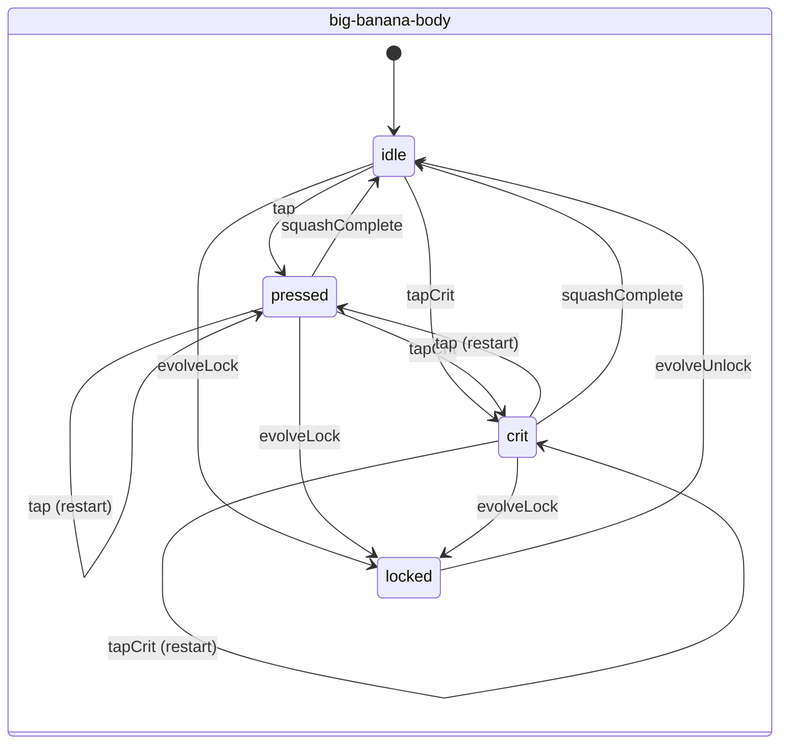
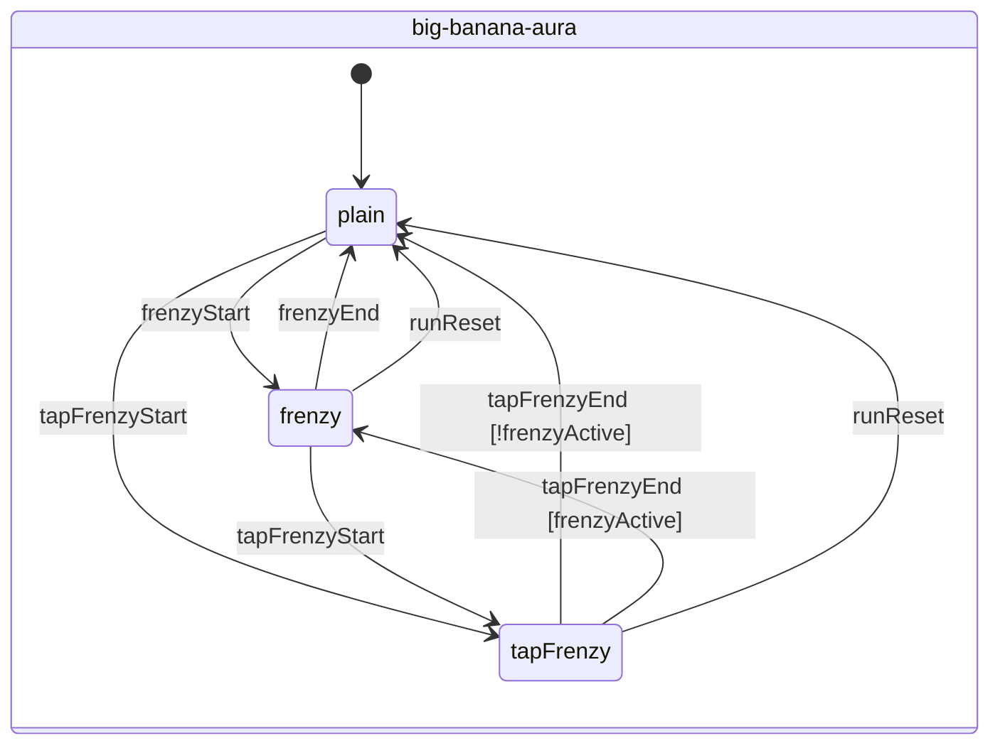
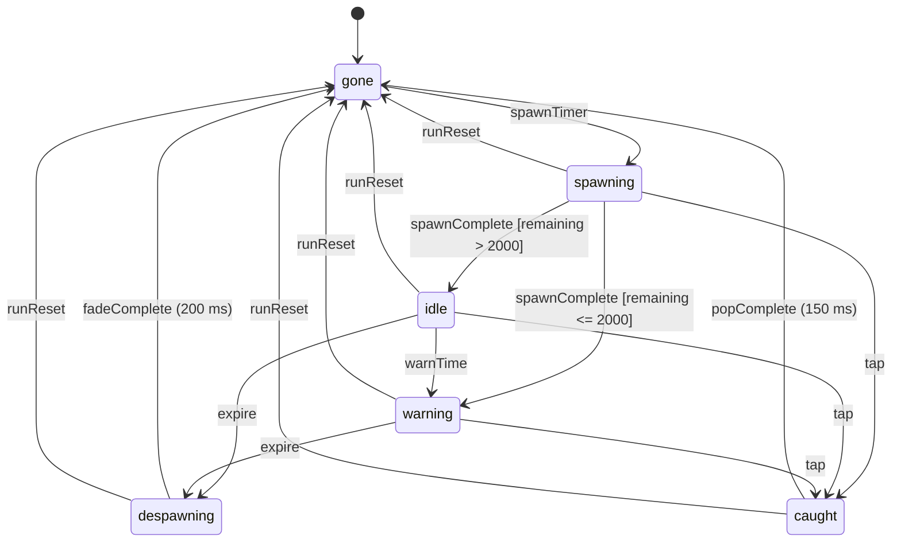

# state-graph-spec — Monkey Bananas

Owner: Animator. Consumer: Game Developer. Schema: gamestudio `animation-state-graph-design/references/state-graph-spec-schema.md`.
Runtime `phaser-frame-by-frame`, so **every transition is a `cut`**; there are no blends (the schema rejects `blend` for frame-by-frame). Each state's motion (frames, tweens, timers) is defined in `object-motion.md`; this file is the routing.

**Priority semantics.** A transition fires if it is listed explicitly for `(from, on)`. `from: any` rows apply only to states whose `interrupt_priority` is below the row's `transition_priority`. States with `terminal` priority leave only through their own explicit exits. Any `(state, event)` pair not listed as a transition is an explicit **ignore** (see each coverage matrix): no animation change and no restart.

**Fallback.** If code ever finds a graph in an unknown state, cut to `default_state` (rest frame for the Big Banana, `gone` for the Golden). Never show "no frame".

The Big Banana uses three **orthogonal** graphs (Harel parallel regions). They run at the same time, and each one owns separate display objects, so they never fight over a property:

| Graph | Owns |
|---|---|
| `big-banana-body` | The body sprite's frame (0-4), the bob container y, the crit flash timer |
| `big-banana-aura` | The halo sprite's pulse, the bob half-period |
| `big-banana-hover` | The halo sprite's hover opacity (the aura, when active, takes precedence on the halo: aura opacity = max(aura, hover)) |

---

## 1. `big-banana-body`

```yaml
graph:
  id: big-banana-body
  description: Big Banana body frame routing (idle bob, quantized tap squash, crit, evolve lock)
  runtime: phaser-frame-by-frame
  default_state: idle

  states:
    - id: idle
      animation_key: bigBanana:0          # rest frame + bob container toggle (1600 ms) + idle fidget timer
      loop: true
      interrupt_priority: low
      on_entry:
        - start_timer: { id: bobResume, ms: 600 }     # bob restarts after 600 ms quiet
        - start_timer: { id: fidget, ms: "U(6000,9000)", repeat: true }
      on_exit:
        - bob_offset: 0                                # cut to 0 on leaving idle
        - stop_timers: [bobResume, fidget]

    - id: pressed
      animation_key: bigBanana:quantized            # setFrame(bandOf(Y)) each frame, frames 0-4
      loop: false
      interrupt_priority: medium
      on_entry:
        - squash_start: { target_Y: "restart ? max(squashMinScaleY, min(squashScaleY, Y_now - (1 - squashScaleY)/3)) : squashScaleY" }
        - set_frame_f0: "band((Y_now + target_Y)/2), at least one band deeper than the current frame"

    - id: crit
      animation_key: bigBanana:quantized
      loop: false
      interrupt_priority: medium
      on_entry:
        - squash_start: { target_Y: squashMinScaleY }
        - set_frame_f0: 1
        - flash_overlay: { ms: 33 }                    # independent timer; survives a following transition
        - camera_shake: { px: critShakePx, ms: critShakeMs, sequence: [3, -3, 2, -2, 1, -1, 0] }

    - id: locked
      animation_key: bigBanana:quantized          # plays one crit-depth squash at t=0 (visual only), then rest
      loop: false
      interrupt_priority: terminal                   # leaves only via its own evolveUnlock exit
      on_entry:
        - input: disabled
        - squash_start: { target_Y: squashMinScaleY, reduced_motion: skip }
      on_exit:
        - input: enabled

  transitions:
    - { from: idle,    to: pressed, on: tap,            type: cut }
    - { from: idle,    to: crit,    on: tapCrit,        type: cut }
    - { from: pressed, to: pressed, on: tap,            type: cut }   # RESTART, never stack
    - { from: pressed, to: crit,    on: tapCrit,        type: cut }
    - { from: pressed, to: idle,    on: squashComplete, type: cut }   # frame 0 is already showing at the end
    - { from: crit,    to: pressed, on: tap,            type: cut }   # restart from the current (deep) Y; the flash keeps running
    - { from: crit,    to: crit,    on: tapCrit,        type: cut }   # RESTART
    - { from: crit,    to: idle,    on: squashComplete, type: cut }
    - { from: any,     to: locked,  on: evolveLock,     type: cut, transition_priority: terminal }
    - { from: locked,  to: idle,    on: evolveUnlock,   type: cut }
```

**Events.** `tap` / `tapCrit` = a *registered* pointer-down or Space press (after the 16/s cap and the Golden hit test). `tapDropped` = over the cap. `squashComplete` = the return tween finishes (always at frame 0). `evolveLock` = ceremony t=0. `evolveUnlock` = ceremony t=1500.

| state \ event | tap | tapCrit | tapDropped | squashComplete | evolveLock | evolveUnlock |
|---|---|---|---|---|---|---|
| idle | → pressed | → crit | ignore | ignore (n/a) | → locked | ignore |
| pressed | → pressed (restart) | → crit | ignore | → idle | → locked | ignore |
| crit | → pressed (restart) | → crit (restart) | ignore | → idle | → locked | ignore |
| locked | ignore (input off) | ignore | ignore | ignore (stays on frame 0) | ignore | → idle |

---

## 2. `big-banana-aura`

```yaml
graph:
  id: big-banana-aura
  description: Buff-driven Big Banana presentation (halo pulse, bob tempo)
  runtime: phaser-frame-by-frame
  default_state: plain

  states:
    - id: plain
      animation_key: bigBanana_halo:off     # halo opacity -> 0 over 300 ms Quad.In on entry (cut if already 0)
      loop: true
      interrupt_priority: low
      on_entry: [ { bob_half_ms: 1600 } ]
    - id: frenzy
      animation_key: bigBanana_halo:off
      loop: true
      interrupt_priority: medium
      on_entry: [ { bob_half_ms: 800 } ]
    - id: tapFrenzy
      animation_key: bigBanana_halo:pulse     # 0.35 <-> 0.85 Sine.InOut yoyo, half-period 1000/(2*tapFrenzyGlowPulseHz): 167 ms at 3 Hz
      loop: true
      interrupt_priority: medium
      on_entry: [ { bob_half_ms: 1600 } ]

  transitions:
    - { from: plain,     to: frenzy,    on: frenzyStart,    type: cut }
    - { from: plain,     to: tapFrenzy, on: tapFrenzyStart, type: cut }
    - { from: frenzy,    to: plain,     on: frenzyEnd,      type: cut }
    - { from: frenzy,    to: tapFrenzy, on: tapFrenzyStart, type: cut, transition_priority: high }   # unreachable per mechanic E5; defined anyway
    - { from: tapFrenzy, to: plain,     on: tapFrenzyEnd,   type: cut, condition: "!frenzyActive" }
    - { from: tapFrenzy, to: frenzy,    on: tapFrenzyEnd,   type: cut, condition: "frenzyActive" }
    - { from: any,       to: plain,     on: runReset,       type: cut, transition_priority: terminal } # evolve reset seam (t=300)
```

| state \ event | frenzyStart | frenzyEnd | tapFrenzyStart | tapFrenzyEnd | runReset |
|---|---|---|---|---|---|
| plain | → frenzy | ignore | → tapFrenzy | ignore | ignore (already plain) |
| frenzy | ignore (a refresh; only the timer bar resets) | → plain | → tapFrenzy | ignore | → plain |
| tapFrenzy | ignore (E5: cannot overlap; the flag is still recorded) | ignore | ignore (refresh) | → plain or → frenzy | → plain |

---

## 3. `big-banana-hover`

```yaml
graph:
  id: big-banana-hover
  description: Mouse hover highlight (no scale, see Objection O2)
  runtime: phaser-frame-by-frame
  default_state: off
  states:
    - { id: off, animation_key: bigBanana_halo:hover0, loop: true, interrupt_priority: low }   # opacity -> 0, 100 ms Quad.Out
    - { id: on,  animation_key: bigBanana_halo:hover,  loop: true, interrupt_priority: low }   # opacity -> 0.3, bigBananaHoverMs Quad.Out; hand cursor
  transitions:
    - { from: off, to: on,  on: pointerOver, type: cut, condition: "pointer.type === 'mouse'" }
    - { from: on,  to: off, on: pointerOut,  type: cut }
    - { from: on,  to: off, on: evolveLock,  type: cut }
```

| state \ event | pointerOver | pointerOut | evolveLock |
|---|---|---|---|
| off | → on (mouse only; touch = ignore) | ignore | ignore |
| on | ignore | → off | → off |

---

## 4. `golden-banana`

```yaml
graph:
  id: golden-banana
  description: Golden Banana lifecycle (pooled object; one on screen max)
  runtime: phaser-frame-by-frame
  default_state: gone               # pooled, invisible, input off

  states:
    - id: spawning
      animation_key: goldenBanana:0  # integer render scale x2 -> x3 -> x4, alpha 0 -> 1 over goldenFadeInMs
      loop: false
      interrupt_priority: medium
      on_entry: [ { input: enabled, hit_radius: goldenHitRadiusPx }, { cue: goldenSpawn } ]
    - id: idle
      animation_key: golden-idle     # frames [0, 3, 0, 2] at 3.2 fps; frame 1 replaces every 2nd frame-0 slot; bob + drift
      loop: true
      interrupt_priority: medium
    - id: warning
      animation_key: golden-idle     # same, flare suppressed, alpha square wave 6 Hz
      loop: true
      interrupt_priority: medium
    - id: caught
      animation_key: goldenBanana:1  # x5 (f0) -> x6 (75 ms), alpha -> 0 over goldenCatchPopMs
      loop: false
      interrupt_priority: high
      on_entry: [ { input: disabled }, { stop: [bob, drift, tilt, lifetimeTimer] }, { fx: goldenBurst }, { camera_shake: [4,4,3,3,2,2,1,1,0] }, { banner: start }, { cue: goldenCatch } ]
    - id: despawning
      animation_key: golden-idle     # continues bob/drift; alpha current -> 0 over goldenDespawnFadeMs
      loop: false
      interrupt_priority: high
      on_entry: [ { input: disabled }, { cue: goldenDespawn } ]
    - id: gone
      animation_key: goldenBanana:0  # invisible (visible=false), returned to the pool
      loop: false
      interrupt_priority: terminal
      terminal: true                 # per instance; the spawner re-enters `spawning` with a fresh instance

  transitions:
    - { from: gone,       to: spawning,   on: spawnTimer,     type: cut }   # content.golden spawn schedule
    - { from: spawning,   to: idle,       on: spawnComplete,  type: cut, condition: "remainingMs > goldenBlinkLastMs" }
    - { from: spawning,   to: warning,    on: spawnComplete,  type: cut, condition: "remainingMs <= goldenBlinkLastMs" }
    - { from: idle,       to: warning,    on: warnTime,       type: cut }   # remainingMs <= goldenBlinkLastMs
    - { from: idle,       to: despawning, on: expire,         type: cut }   # guard in case warnTime was skipped (tab hitch)
    - { from: warning,    to: despawning, on: expire,         type: cut }
    - { from: spawning,   to: caught,     on: tap,            type: cut, transition_priority: high }
    - { from: idle,       to: caught,     on: tap,            type: cut, transition_priority: high }
    - { from: warning,    to: caught,     on: tap,            type: cut, transition_priority: high }
    - { from: caught,     to: gone,       on: popComplete,    type: cut }
    - { from: despawning, to: gone,       on: fadeComplete,   type: cut }
    - { from: any,        to: gone,       on: runReset,       type: cut, transition_priority: terminal }  # evolve seam: no fx, no cue
```

**Events.** `tap` = pointer-down within `<goldenHitRadiusPx>` of the Golden centre (tested before the Big Banana, mechanic E6). The `spawnComplete`, `warnTime`, `expire`, `popComplete` and `fadeComplete` timers run on scene time, which pauses while the page is hidden (content `timerRunsOnlyWhileVisible`).

| state \ event | spawnTimer | spawnComplete | tap | warnTime | expire | popComplete | fadeComplete | runReset |
|---|---|---|---|---|---|---|---|---|
| gone | → spawning | ignore | ignore (input off) | ignore | ignore | ignore | ignore | ignore |
| spawning | ignore | → idle / → warning | → caught | ignore (handled by the spawnComplete condition) | ignore (lifetime ≫ fade-in) | ignore | ignore | → gone |
| idle | ignore | ignore | → caught | → warning | → despawning | ignore | ignore | → gone |
| warning | ignore | ignore | → caught | ignore | → despawning | ignore | ignore | → gone |
| caught | ignore | ignore | ignore (one catch per Golden) | ignore | ignore (timer stopped) | → gone | ignore | → gone |
| despawning | ignore | ignore | ignore (passes through, no catch) | ignore | ignore | ignore | → gone | → gone |

**Reachability check.** `gone → spawning → {idle, warning} → despawning → gone`, and `{spawning, idle, warning} → caught → gone`. Every state is reachable from the default. Every non-terminal state has an exit. `gone` is terminal per instance and re-enterable by the pool. Every state has a frame. There are no blend rows. No `(from, on)` pair is duplicated without a distinguishing `condition`.

---

## 5. Diagrams (human review; the YAML above is authoritative)







## 6. Wiring notes for the developer
- The Big Banana squash is **not** a Phaser `Animation`. It is a tween on a plain number plus `setFrame(band(Y))` in `onUpdate`. The idle bob is a looped `TimerEvent`. The critter and Golden idles *are* Phaser animations (`anims.create` with the frame lists above).
- Apply the f0 frame synchronously in the input handler, before the tween's first tick, so `<tapLatencyTargetFrames>` = 1 holds.
- On a restart, kill the previous squash tween (`tween.remove()`) before creating the new one. Never keep two squash tweens alive (stacking would fight over Y).
- The hit area never reads the current frame (object-motion §1.1).
- Reduced-motion changes are parameters inside states (amplitudes, frames, fx counts); they never change the routing. Under reduced motion the Golden's `idle`/`warning` are static (no bob, tilt or drift; the warning blinks at 2 Hz), and the critter idles are frozen (ux/settings-and-a11y.md §4).
