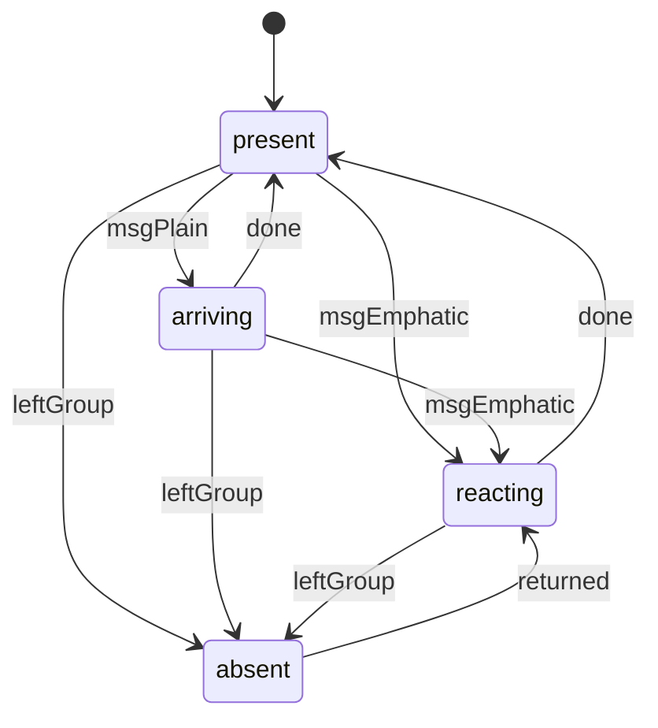
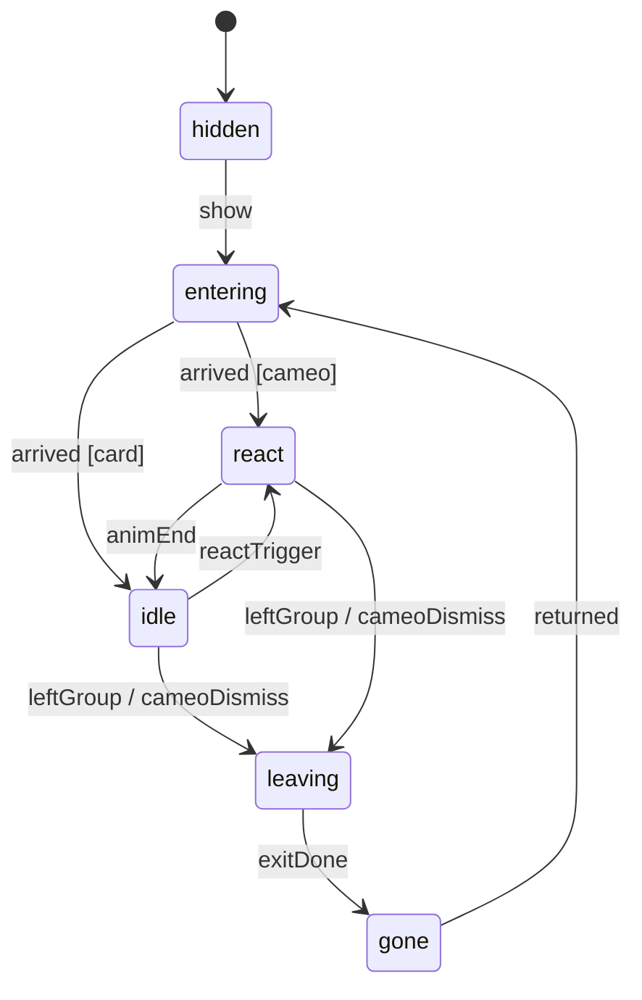
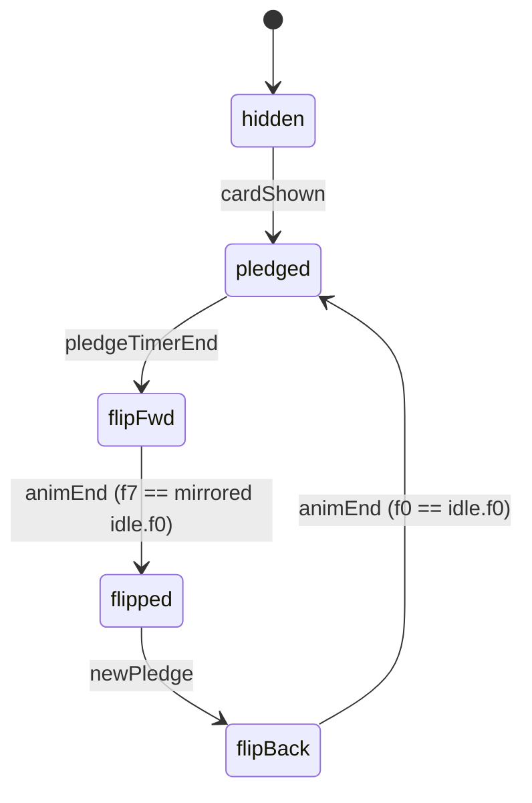

# state-graph-spec: the cast (partners, Sara, Bennett, opposition cards)

**Owner:** Animator. **Consumers:** Game Developer, Audio Director, UX Designer (placement), 2D Artist (pending art).

**Runtime:** `godot-animatedsprite2d`. It is frame-by-frame, so every transition is a cut. Global rules are in
[`README.md`](README.md). The Magician is in [`state-graph-magician.md`](state-graph-magician.md).

**Source strips (approved and locked):** `creative-pack/od-sevev/art/showcase/out/atlas.json`.

| Figure | Strips | React type | React markers | React length |
|---|---|---|---|---|
| Ben Gvir, Gotliv | `idle` 20@10, `react` 10@14 | **jab** (angry arm jab + shake) | `shout: 2` | 714 ms |
| Levin | `idle` 20@10, `react` 12@14 | **bang** (fist comes down twice) | `bang: 4`, `bang2: 8` | 857 ms |
| Deri, Goldknopf, Regev | `idle` 20@10, `react` 8@14 | **hop** (pleased bounce) | `land: 6` | 571 ms |
| Sara | `idle` 20@10, `offended` 12@12 | — | `huff: 2` | 1000 ms |
| Bennett | `idle` 20@10, `flip` 8@12 | — | `whoosh: 3` | 667 ms (one direction) |
| Every figure | `avatar` 32×32 (static head crop, ring colour = react type) | — | — | — |
| Pending art (REQUESTS.md) | Karhi, May Golan, Distel, the Smotrich redo, Lapid, Eisenkot, Gantz, Liberman, Golan, Abbas, Herzog, Trump | They use the **avatar-only** path below until their strips land. | — | — |

**Note.** `cast.py` gives Gafni `react: 'sneak'`, but `build.py` has no `sneak` branch, so his strip would render as a
**hop**. The spec below treats Gafni as a hop until a sneak strip exists. The "goes to the bathroom" sneak would need a
new strip, which is not requested for launch.

## Measured seams (all cast strips, pixel-diffed)

| Pair | Changed px | Rule |
|---|---|---|
| every `react` / `offended` / `flip` f0 vs its `idle.f0` | 0 | **f0 is the rest pose, so every action strip is entered at f1.** Showing f0 from a breath-down idle frame would present a 1-ap body pop on a *still* frame for 71-83 ms. Entering at f1 puts the pop inside the action's first silhouette change (a crouch, a squash, a raised arm, or a 25% horizontal squash for the flip), which masks it. Markers keep their atlas indices. |
| every action's last frame vs its `idle.f0` | 0 | action → idle is a seamless cut to `idle.f0` |
| `bennett.flip.f7` vs `bennett.idle.f0` mirrored | 0 | After the flip he idles on the **mirrored idle strip** (`flip_h = true`), with no new art. The reverse flip returns seamlessly. |
| `idle.f5..f15` vs `idle.f0` | 700-2000 | breath-down (see the f1 rule above) |

**Idle phase.** Every cast instance starts its idle at `randi() % 20`. Every strip blinks on a fixed frame (f9-f11 for
the generic rig), so partners that started together would blink in unison. A randomised phase also breaks the 2.0 s
metronome across a line-up, which matters over a long idle session.

---

## 1. `partner-avatar` (in-thread; always on; all partners, including those with pending art)

The 32×32 avatar is static art, so it animates by **transform only**: a y/x "echo" of the partner's react type, stepped
at the react strip's own 14 fps (71 ms per step). That way the avatar in the thread and the full body on the card move
to the same rhythm.
- `aap` is one avatar art px, which is the avatar's render scale.
- `+x` points toward the bubble text, which is leftward in RTL.
- Positions are stepped, with no easing between steps.

```yaml
echoes:                       # per step (71 ms), in aap; y: negative = up
  arrival: { y: [0, -1, 0] }                                        # 3 steps, 214 ms: any plain message landing
  hop:     { y: [0, 1, -2, -4, -3, -1, 1, 0] }                      # 8 steps, 571 ms; the step-6 +1 is the landing squash (atlas land: 6)
  jab:     { y: [0, 1, 0, 0, 0, 0, 0, 0, 0, 0], x: [0, 0, 1, -1, 1, -1, 1, 0, 0, 0] }   # 10 steps, 714 ms; step 2 = shout
  bang:    { y: [0, -1, -2, 1, 2, 0, -1, 1, 2, 0, 0, 0] }           # 12 steps, 857 ms; steps 4 and 8 = bang, bang2
```

```yaml
graph:
  id: partner-avatar
  description: One partner's avatars in the coalition thread (all bubbles by that partner share the state)
  runtime: godot-transform-tweens
  default_state: present
  states:
    - { id: present,  animation_key: avatar,         loop: true,  interrupt_priority: low }
    - { id: arriving, animation_key: avatar+arrival, loop: false, interrupt_priority: low,    note: "only the NEW bubble's avatar moves" }
    - { id: reacting, animation_key: avatar+<reactType>, loop: false, interrupt_priority: medium, note: "only the newest bubble's avatar moves" }
    - id: absent                                     # left the group
      animation_key: avatar (desaturated)
      loop: true
      interrupt_priority: low
      on_entry: [ { all_avatars_of_partner: "cut to the palette's greyed ramp + alpha 0.6 at the system line's f0" } ]
  transitions:
    - { from: present,  to: arriving, on: msgPlain,     type: cut }     # a demand / thanks / chatter bubble lands
    - { from: present,  to: reacting, on: msgEmphatic,  type: cut }     # ultimatum, threat tick ("60", "30"), paid-thanks, returned
    - { from: arriving, to: reacting, on: msgEmphatic,  type: cut }
    - { from: arriving, to: present,  on: done,         type: cut }
    - { from: reacting, to: present,  on: done,         type: cut }
    - { from: reacting, to: reacting, on: msgEmphatic,  ignore: true, note: "no restart; the new bubble lands still (fatigue guard)" }
    - { from: [present, arriving, reacting], to: absent, on: leftGroup, type: cut }
    - { from: absent,   to: reacting, on: returned,     type: cut, note: "colour restored at f0, then the signature echo" }
    - { from: absent,   to: absent,   on: msgPlain,     ignore: true, note: "an absent partner cannot post" }
    - { from: any,      to: present,  on: chatCleared,  type: cut, note: "election reset clears the thread (UX §1.2 rule 5)" }
```

| state \ event | msgPlain | msgEmphatic | done | leftGroup | returned | chatCleared |
|---|---|---|---|---|---|---|
| present | → arriving | → reacting | n/a | → absent | ignore (already in) | → present |
| arriving | restart the arrival on the new bubble | → reacting | → present | → absent | ignore | → present |
| reacting | the new bubble lands still | ignore (no restart) | → present | → absent (echo cut to 0) | ignore | → present |
| absent | ignore | ignore | n/a | ignore | → reacting | → present |

- **Sync.** The echo's step 0 is the bubble's landing frame (`chat-message-arrival` in motion-spec, +180 ms).
- **Reduced motion:** no echoes and no arrival. `absent` greying is kept, because it carries information and is not
  motion.

---

## 2. `partner-body` (full-body idle + react: the partner card, and the proposed stage cameo)

**Where it plays.** UX owns placement.
- **(a) The partner card.** REQUESTS.md already names a "partner card". It is opened by tapping a partner's name or
  avatar in the thread (UX to confirm the entry point). The card shows the figure at integer scale `Sp`, idling. React
  and leave/return play here while the card is open.
- **(b) Stage cameo (a proposal, pending UX).** A partner **with an open ultimatum** stands at the stage's right edge
  (RTL entry side) at `Sp = S - 1` (a smaller scale is a depth cue that they are behind the Magician). They stay for the
  90 s countdown and jab at the "60" and "30" posts. Paid: they hop (or react) and leave. Expired: they react and storm
  off.
  - This puts the gameplay-critical timer on the stage for players who have the chat closed.
  - At most **1 cameo** at a time, the newest ultimatum. The cameo never enters the Suitcase band (y 440-500 CSS) or the
    Magician's hit area.
  - If UX declines it, only surface (a) exists and nothing else changes.

```yaml
graph:
  id: partner-body
  runtime: godot-animatedsprite2d
  default_state: hidden
  states:
    - { id: hidden,  animation_key: "<name>.idle@f0", loop: false, interrupt_priority: low, on_entry: [ { visible: false } ] }
    - id: entering
      animation_key: "<name>.idle@f0"        # held; slides in
      interrupt_priority: medium
      on_entry: [ { visible: true }, { card: "appears with the card (card motion owns it)" }, { cameo: "x offRight → mark, 240 ms Quad.Out, snap Sp" } ]
    - { id: idle,    animation_key: "<name>.idle", loop: true, interrupt_priority: low, on_entry: [ { frame: "randi() % 20 (card open / cameo arrival)" } ] }
    - id: react
      animation_key: "<name>.react"
      loop: false
      interrupt_priority: medium
      on_entry: [ { frame: 1 } ]             # f1 rule
      queue: "one pending react (a trigger during react plays once after animEnd if < 1500 ms old; further ones dropped)"
    - id: leaving
      animation_key: "<name>.react → <name>.idle@f0"
      interrupt_priority: high
      on_entry: [ { play: "react from f1 (the storm-off: jab-types jab, bang-types bang, hop-types hop)" } ]
      then: "at animEnd: hold idle.f0; card: grey + 'עזב/ה' label cut (UX copy); cameo: x mark → offRight 200 ms Quad.In"
    - { id: gone,    animation_key: "<name>.idle@f0", loop: false, interrupt_priority: low, on_entry: [ { visible: false } ] }
  transitions:
    - { from: hidden,   to: entering, on: show,        type: cut }        # card opened, or cameo spawn (ultimatum posted, stage visible)
    - { from: entering, to: react,    on: arrived,     type: cut, condition: "cameo", note: "they announce themselves" }
    - { from: entering, to: idle,     on: arrived,     type: cut, condition: "card" }
    - { from: idle,     to: react,    on: reactTrigger, type: cut }
    - { from: react,    to: idle,     on: animEnd,     type: cut, note: "last frame == idle.f0; resume idle at f0" }
    - { from: react,    to: react,    on: reactTrigger, ignore: true, note: "queued (1 max)" }
    - { from: [idle, react, entering], to: leaving, on: leftGroup, type: cut }
    - { from: [idle, react], to: leaving, on: cameoDismiss, type: cut, condition: "cameo && ultimatum paid", note: "a pleased exit: react, then slide out" }
    - { from: leaving,  to: gone,     on: exitDone,    type: cut }
    - { from: gone,     to: entering, on: returned,    type: cut }
    - { from: any,      to: hidden,   on: hide,        type: cut }        # card closed / stage covered by a tall tab / ceremony curtain
```

**Triggers (`reactTrigger`):**
- an ultimatum posted;
- a threat tick (Ben Gvir's "60" and "30");
- paid-thanks;
- `returned`;
- Gotliv's transfer (she jabs at the whistle's long note);
- Levin skipped ("עותר לבג״ץ… רגע", a bang).

A plain demand does **not** react. A partner posts about every 90 s, and reacting to every post would fatigue.

| state \ event | show | arrived | reactTrigger | animEnd | leftGroup | cameoDismiss | exitDone | returned | hide |
|---|---|---|---|---|---|---|---|---|---|
| hidden | → entering | n/a | ignore (not visible) | n/a | ignore | ignore | n/a | ignore | stay |
| entering | ignore | → react (cameo) / idle (card) | queue | n/a | → leaving | ignore | n/a | ignore | → hidden |
| idle | ignore | n/a | → react | n/a (loop) | → leaving | → leaving | n/a | ignore | → hidden |
| react | ignore | n/a | queue (1) | → idle (or react again if queued) | → leaving | → leaving | n/a | ignore | → hidden |
| leaving | ignore | n/a | ignore | holds idle.f0; slide / grey | ignore | ignore | → gone | ignore | → hidden |
| gone | → entering (card shows the "left" state statically; see note) | n/a | ignore | n/a | ignore | ignore | n/a | → entering | → hidden |

- **Note.** A card opened for a partner who has left shows the figure at `idle.f0`, greyed, with no idle loop. That is
  UX's "left" card state. It is modelled as `gone` → `entering` with `absent: true`, which holds f0 and plays no react.
- **Reduced motion:**
  - Idle loops are kept, because they are in-place and move 1 ap.
  - Reacts are kept on the **card**, where they are in-place and user-summoned.
  - The **cameo** slides become 150 ms fades.
  - The storm-off plays its react, then fades.

---

## 3. `sara` (Balfour-era stage presence; no mechanic of her own, per pitch §6)

**Placement.** She stands on the Balfour stage background. The 2D Artist and UX own her mark, which must avoid the
thermometer (x 12-56 CSS), the Magician's hit area and the Suitcase band. She is hidden in eras 2-4. Era changes happen
under the election curtain, as a cut with nothing visible.

**Offended triggers.** These are proposals. The Game Designer owns triggers, and each must stay inside the copy deck's
red lines.
- **(1)** The bottle-deposit spin **S01** is bought (commit f0). S01 is her only reference in the game (pitch §6), and
  her huff at the purchase is the joke without naming her.
- **(2)** The pistachio spin is bought. This is optional and is the Game Designer's call.
- **Bar, 2026-10-02: she IS the tap target while she is on the stage** (this replaces "not a tap target"). A tap on the
  leader earns nothing while she waits (she huffs, a toast says to tap her); a gold arrow bobs over her head; a tap on her
  sends her off. She stays until tapped (`ui/sara_mark.gd`).
- There is a **cooldown of 8000 ms**: triggers inside it are dropped.
- There is a **delay of 150 ms after the commit** (reaction time), so the buy feedback reads first and her huff second.

```yaml
graph:
  id: sara
  runtime: godot-animatedsprite2d
  default_state: idle
  states:
    - { id: idle,     animation_key: sara.idle,     loop: true,  interrupt_priority: low, on_entry: [ { frame: "randi() % 20 on first show; 0 after offended" } ] }
    - { id: offended, animation_key: sara.offended, loop: false, interrupt_priority: medium, on_entry: [ { frame: 1 } ], markers: { huff: 2 } }
    - { id: absent,   animation_key: sara.idle@f0,  loop: false, interrupt_priority: low, on_entry: [ { visible: false } ] }
  transitions:
    - { from: idle,     to: offended, on: saraOffend, type: cut, condition: "cooldownElapsed" }
    - { from: idle,     to: idle,     on: saraOffend, ignore: true, condition: "!cooldownElapsed" }
    - { from: offended, to: idle,     on: animEnd,    type: cut }
    - { from: offended, to: offended, on: saraOffend, ignore: true }
    - { from: [idle, offended], to: absent, on: eraNotBalfour, type: cut }
    - { from: absent,   to: idle,     on: eraBalfour, type: cut }
```

| state \ event | saraOffend | animEnd | eraNotBalfour | eraBalfour |
|---|---|---|---|---|
| idle | → offended (after 150 ms, if the cooldown has elapsed) | n/a | → absent | ignore |
| offended | ignore | → idle f0 | → absent | ignore |
| absent | ignore | n/a | ignore | → idle |

- **Reduced motion:** kept, because it is in-place.
- `huff` fires at f2, which is 83 ms after the f1 entry. It is a visual beat. The sonic brief has no Sara cue, so its
  audio is `null` unless the Audio Director adds one.

---

## 4. `bennett` (the pledge card: a ping-pong flip across two events)

**The joke:** he signs, the pledge timer runs out, and he flips. He stays flipped until he signs the next pledge (T27,
"הפעם בעיפרון"), and then he flips back.
- **Forward and reverse are separate events.** That is the "ping-pong" in the brief.
- While he is flipped, the **mirrored idle** plays (`flip_h`). This is seamless (0 px) and needs no new art.

```yaml
graph:
  id: bennett
  runtime: godot-animatedsprite2d
  default_state: hidden
  states:
    - { id: hidden,       animation_key: bennett.idle@f0, loop: false, interrupt_priority: low, on_entry: [ { visible: false } ] }
    - { id: pledged,      animation_key: bennett.idle, loop: true, interrupt_priority: low, on_entry: [ { flip_h: false }, { frame: "randi() % 20" } ] }
    - id: flipFwd
      animation_key: bennett.flip
      loop: false
      interrupt_priority: high
      on_entry: [ { flip_h: false }, { play: forward, frame: 1 } ]
      markers: { whoosh: 3, textSwap: 4 }        # textSwap: the card's pledge text cuts to its reversal on the first mirrored frame
    - { id: flipped,      animation_key: bennett.idle, loop: true, interrupt_priority: low, on_entry: [ { flip_h: true }, { frame: 0 } ] }   # flip.f7 == mirrored idle.f0
    - id: flipBack
      animation_key: bennett.flip
      loop: false
      interrupt_priority: high
      on_entry: [ { flip_h: false }, { play_backwards: true, frame: 6 } ]   # f7 == mirrored idle.f0 is skipped (f1 rule, mirrored)
      markers: { whoosh: "3 (when frame 3 is shown, in either direction)", textSwap: 3 }
  transitions:
    - { from: hidden,  to: pledged,  on: cardShown,     type: cut }
    - { from: pledged, to: flipFwd,  on: pledgeTimerEnd, type: cut }
    - { from: flipFwd, to: flipped,  on: animEnd,       type: cut }
    - { from: flipped, to: flipBack, on: newPledge,     type: cut }
    - { from: flipBack, to: pledged, on: animEnd,       type: cut, note: "f0 == idle.f0" }
    - { from: [flipFwd, flipBack], to: "(same)", on: pledgeTimerEnd, ignore: true }
    - { from: flipFwd, to: flipFwd,  on: newPledge,     ignore: true, note: "latch; flipBack starts at flipFwd's animEnd → flipped (1 frame) → flipBack" }
    - { from: any,     to: hidden,   on: cardHidden,    type: cut }
```

| state \ event | cardShown | pledgeTimerEnd | newPledge | animEnd | cardHidden |
|---|---|---|---|---|---|
| hidden | → pledged | ignore | ignore | n/a | stay |
| pledged | ignore | → flipFwd | ignore (already pledged) | n/a | → hidden |
| flipFwd | ignore | ignore | latch | → flipped (then flipBack if latched) | → hidden |
| flipped | ignore | ignore (already broken) | → flipBack | n/a | → hidden |
| flipBack | ignore | ignore | ignore | → pledged | → hidden |

- **Timing.** The pledge timer bar is Linear, because it is a progress bar. It reaches 0 on the same frame that
  `flipFwd` enters, and `textSwap` lands 250 ms later, on the first mirrored frame. The card never scales: a card flip
  done with `scaleX` would squeeze pixel text for more than 180 ms. His body turning *is* the flip.
- **Reduced motion:** kept. It is an in-place 667 ms turn, the mechanic's information carrier.

---

## 5. `opposition-figure` (the figure on an opposition card; the card motion itself is `opposition-card` in motion-spec)

The generic figure is used by every card except Bennett's, who has his own graph (§4).

```yaml
graph:
  id: opposition-figure
  runtime: godot-animatedsprite2d
  default_state: hidden
  states:
    - { id: hidden,     animation_key: "<name>.idle@f0 | <name>_avatar", loop: false, interrupt_priority: low, on_entry: [ { visible: false } ] }
    - { id: idle,       animation_key: "<name>.idle", loop: true, interrupt_priority: low, on_entry: [ { frame: "randi() % 20" } ] }
    - { id: placeholder, animation_key: "<name>_avatar (static; art pending in REQUESTS.md)", loop: false, interrupt_priority: low }
  transitions:
    - { from: hidden, to: idle,        on: cardShown,  type: cut, condition: "strip exists" }
    - { from: hidden, to: placeholder, on: cardShown,  type: cut, condition: "!strip exists" }
    - { from: [idle, placeholder], to: hidden, on: cardHidden, type: cut }
```

**Per-card twists.** Each card's mechanic is its joke. The motion lives in the card and on the stage, not in the figure.

| Card | Twist motion | Where specified |
|---|---|---|
| Lapid, "איפה הכסף?" (audit) | A magnifier glint sweeps the revealed shady source's card, then a `+suspicion` tick | motion-spec `opposition-card` twists.lapid |
| Eisenkot, "ישר" (no rabbits) | **On card enter:** the rabbit's ears peek from the Magician's hat and duck ("הארנבים יצאו לחל״ת"), once. While the card is shown, `rabbitsAllowed = false`, and the Magician graph degrades any `tapCrit`. | Below, plus motion-spec twists.eisenkot |
| Gantz (a stand-in, rotation 99%) | The rotation bar fills to 99% and **creeps without ever arriving** | motion-spec twists.gantz |
| Liberman, "לא יושב" | Buttons are greyed. A tap plays the shake with no cost. | motion-spec twists.liberman |
| Golan (merger) | The last two cards slide together and fuse | motion-spec twists.golan |
| Abbas (visible only while Ben Gvir is offline) | The card fades in 600 ms after Ben Gvir's "left" line and fades out on his return | motion-spec twists.abbas |
| Bennett (pledge) | §4 | this file |

**Eisenkot's ear-duck.** It reuses the coin-peek technique: `prop_rabbit` is drawn behind the Magician at
`hatMouth.idle[frame]`.
- The ears rise 3 ap (150 ms Quad.Out), hold 250 ms, and sink 15 ap into the hat (200 ms Quad.In, clipped by the hat
  body): 600 ms in total.
- It plays only if the body is in `idle`. Otherwise it is skipped, because the card's copy carries the joke.
- **Reduced motion:** skipped.

---

## 6. Diagrams







## 7. Wiring notes

- Build one `SpriteFrames` per figure from `atlas.json`. `react`, `offended` and `flip` are non-looping. Markers fire from
  `frame_changed`.
- `flipBack` uses `play_backwards("flip")`, then `set_frame_and_progress(6, 0)`. The `whoosh` marker is "frame 3 is
  displayed", checked in `frame_changed` for both directions.
- Avatar echoes are a stepped `Tween` of `position` with `TRANS_LINEAR`, applied through a setter that snaps to `aap`
  (see README §3, `Stepped`). Alternatively, use a 71 ms `Timer` that indexes the keyframe array. Both are scene-time.
- Figures whose art is pending go through `placeholder` automatically when their strip is missing from `SpriteFrames`,
  so no code change is needed when the art lands. This is the runtime-animation-wiring DOG.
