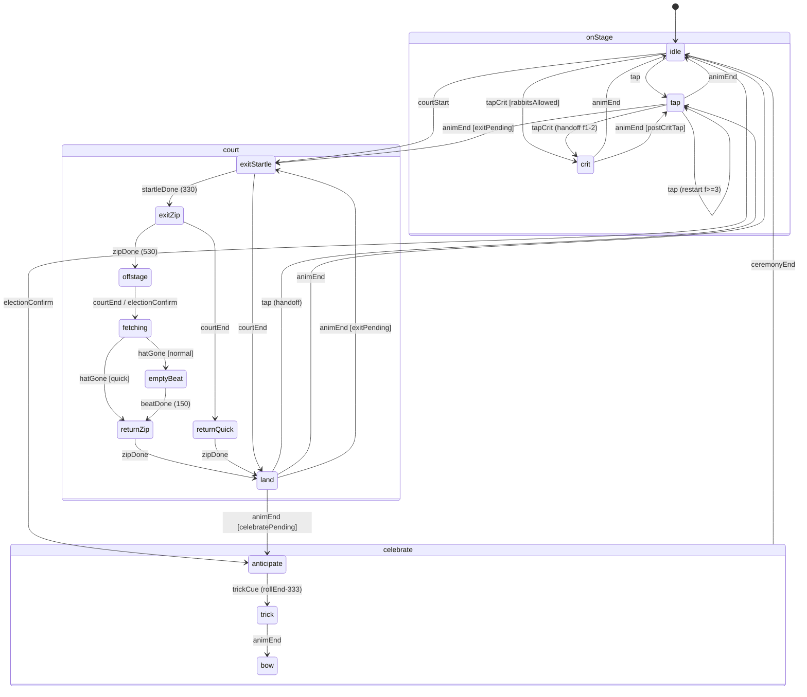
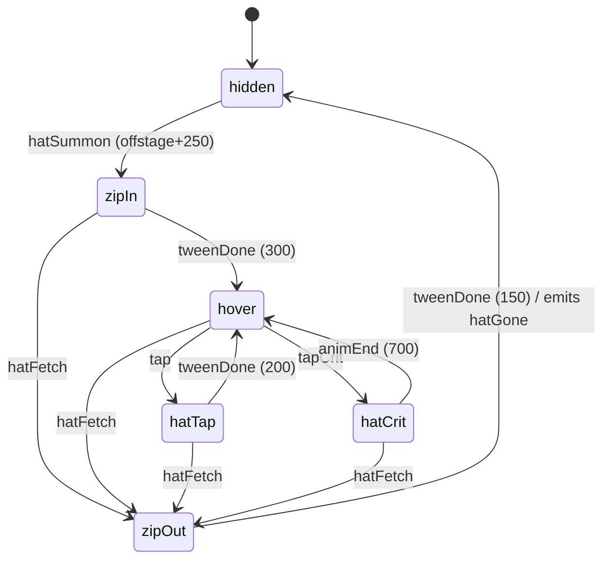

# state-graph-spec: the Magician ("הקוסם") on stage

**Owner:** Animator. **Consumers:**
- Game Developer, for Godot wiring.
- Audio Director, for the markers in [`event-markers.md`](event-markers.md).
- Technical Artist, for the atlas and fx-data.

**Schema:** gamestudio `animation-state-graph-design/references/state-graph-spec-schema.md`.

**Runtime:** `godot-animatedsprite2d`. This is frame-by-frame, so **every transition is a `cut` or an authored clip**, and
there are no blends. Global rules are in [`README.md`](README.md).

**Source strips (approved and locked):** `gamestudio/output/artifacts/creative-pack/od-sevev/art/showcase/out/atlas.json`.

| Strip | Frames @ fps | Length | Loop | Markers (atlas key: frame) | Notes |
|---|---|---|---|---|---|
| `bibi.idle` | 20 @ 10 | 2000 ms | yes | none | Breath-down on f5-f15 (body 1 ap lower). Blink on f16-f18. The finger sways ±5° once per loop. |
| `bibi.tap` | 8 @ 15 | 533 ms | no | `coins: 3` | f1 squash, f2 stretch (hat +4 ap), f3 hat peak (+8 ap), f4-f7 settle. `hatMouth[8]` is given. |
| `bibi.crit` | 14 @ 12 | 1167 ms | no | `coins: 3`, `rabbit: 4`, `sting: 5` | The brief's "wink@5" is keyed **`sting`** in the atlas. Use the atlas key. f5-f9 hold the full wink (417 ms). |

**Frame size** 81×125 art px, **anchor** [40, 124] (the feet; padded in wave 2). **`S`** is the Magician's integer render
scale: `sprites.json` `artScale` = **4**, with the feet at `magicianFeet` (94, 219) art px. **`ap`** is one art px, which is `S`
logical px.

### Measured seams

The seams were diffed pixel by pixel on the approved PNGs. This is the ground truth for every cut below.

| Pair | Changed px | Consequence |
|---|---|---|
| `tap.f0` vs `idle.f0` | 0 | tap f0 is the rest pose, so its 67 ms are pure latency. **Enter tap at f1** (the squash) on the input frame. |
| `tap.f7` vs `idle.f0` | 0 | tap → idle is seamless. |
| `crit.f13` vs `idle.f0` | 0 | crit → idle is seamless. |
| `crit.f1..f3` vs `tap.f1..f3` | 0 / 0 / 2 | tap → crit can **hand off at the same frame index** with no pop. |
| `idle.f16..f19, f0..f4` vs `idle.f0` | ≤ 330 | This is the "upright window": only the finger and arm sway. |
| `idle.f5..f15` vs `idle.f0` | 1400-1860 | The whole body is 1 ap lower. A cut from here to `tap.f1` pops 1 ap, and **the squash masks it**, because the squash itself moves the head down about 6 ap. |

### Hat-mouth tables (authoritative: `game/assets/sprites/sprites.json`)

The hat-mouth tables give where coins, the coin peek, the hat glow, Dubi's perch and the taxpayer's coin toss attach,
in frame-local art px.
- **The source is `sprites.json` `chars.bibi.anims.{idle,tap,crit}.hatMouth`**, one entry per frame. They are exact:
  - `tap` comes from the render;
  - `idle` and `crit` are pixel-matched by the TA, and the build fails if the match ever disagrees with the render.
- **Code reads that table and never copies it.**
- The values below are a reviewer's copy of the padded frame (wave 2: `frameW` 81, anchor [40, 124]; O-M1 is
  resolved).

```yaml
hatMouth:   # reviewer copy, 81×125 frame; sprites.json wins on any difference
  tap:  [[15,34],[13,38],[18,27],[17,25],[16,27],[15,31],[15,33],[15,34]]
  crit: [[15,34],[13,38],[18,27],[17,25],[16,26],[16,26],[16,26],[16,26],[16,26],[16,26],[16,26],[15,29],[15,32],[15,34]]
  idle: [[15,34],[15,34],[14,34],[14,34],[14,34],[14,35],[14,35],[14,35],[14,35],[15,35],
         [15,35],[16,35],[16,35],[16,35],[17,35],[17,34],[17,34],[16,34],[16,34],[16,34]]
hatTop: "hatMouth - (0, 2): the hat's top outline row, where Dubi perches (state-graph-dubi.md)"
```

---

## 1. The rules the graph encodes

### 1.1 The crit (rabbit) rule
This is not a placeholder. The rule comes from the economy: pitch §11 Q1/Q5, first-minute H2 and the copy deck §F.
- **Tap 7 is a scripted rabbit.** It fires once per save, when `taps_total == 7 AND rabbits == 0`, and pays ×4.
- **After that:** a 2% base chance per registered tap, paying ×10. Spin S11 raises the chance.
- **No rabbits while Eisenkot's card is on screen.** When `rabbitsAllowed == false`, the economy rolls no crit.
- The numbers belong to the Game Designer (`content.json` `tap.*`). The graph only reads the result:
  - the economy tags each registered tap as `tap` or `tapCrit` **before** f0 renders;
  - the scripted rabbit is a `tapCrit` with `scripted: true`.
- **Guard.** If a `tapCrit` arrives while `rabbitsAllowed == false`, for example on the same frame Eisenkot's card
  leaves, the graph **degrades it to `tap`**. It shows no rabbit, because a rabbit on screen would contradict the card.
- **Court day.** I recommend that crits stay live during court day, and show as the hat-only `hatCrit` in §3: the rabbit
  pops up, sees the courtroom, and ducks, which *is* H-court's "הארנב מתחבא בכובע". If the Game Designer rules no crits
  in court, `hatCrit` is simply unreachable. No routing changes.

### 1.2 Tap buffering and coins when taps outrun the 15 fps strip
- **Registered taps.** A registered tap is one that passes the `tap.maxRegisteredTapsPerSec` cap (16/s, content.json)
  after the Suitcase hit test.
  - It always gets its **floater, its counter snap and its tap cue at its own f0**. That is the truth channel, and it
    never waits for the body.
  - Dropped taps get nothing, as in legacy.
- **The body is a pump, and it cannot show 16 pumps a second on a 15 fps strip.** The rules below turn any tap rate into
  a readable rhythm:

| Tap arrives while | Body | Coins |
|---|---|---|
| `idle`, or `land`/`tap` at f ≥ 4, or at f3 after it has shown for ≥ 33 ms | **Restart** `tap` at f1 on this render frame | This tap opens a new batch: `batch = 1` |
| `tap` or `land` at f1-f2 | No change. The strip keeps playing. | **Merge:** `batch += 1`. The batch bursts when f3 is entered. |
| `tap` at f3, shown for < 33 ms | Latch. Restart at f1 once f3 has shown for 33 ms (2 render frames), so the coin-peak frame is never skipped. | The tap goes to the *next* batch |
| `crit` at f1-f2 | No change | Merged into the crit burst at f3 |
| `crit` at f ≥ 3 | No change. The crit is never cut by a tap. | **Spill:** 1 coin from `hatMouth.crit[frame]` at this tap's f0, rate-capped at 1 per 67 ms. Latch `postCritTap`. |
| any exit, zip or `anticipate`/`trick`/`bow` state | No change | None. The floater only. |

**Coins per burst.** The payout is shown in digits, so coins never scale with money. This is the deadpan rule, and it
mirrors the sonic brief's cap of 6 blips.
- **Tap:** `min(3 + (batch - 1), 6)`.
- **Crit:** `min(10 + (batch - 1), 12)` plus 2 `bill` props.
- **Reduced motion:** 3 coins, no arcs (UX §7.3).
- The particle motion is `coin-burst` in `motion-spec.yaml`.

**What it looks like at speed**, with a tap at f0 = 0 ms:

| Rate | Pump cycle | Coins |
|---|---|---|
| ≤ 3.75/s | Every tap gets its own pump and burst (one tap every ≥ 267 ms reaches f4+) | One burst per tap |
| 8/s | f1 → f3 at 133 ms (2 taps merged) → restart on the next tap at f4, a 250 ms cycle | 4 coins per burst |
| 16/s (the cap) | Taps at 0, 62 and 125 merge. The burst of 5 coins fires at 133. The 187 ms tap restarts, giving a ~187 ms cycle. | About 5.3 pumps/s, never more than 6 coins alive per burst |

The hat bobbing between f1 and f3 at about 5 Hz reads as frantic pulling, which is the intended read. No frame is
ever shown for less than one render frame, and the coin-peak frame (f3) always shows for at least 33 ms.

### 1.3 Court day: exit and return with no walk cycle
**Why no walk cycle.** A walk strip was considered and **not requested**.
- A 1-2 s walk off a 350-px stage at a believable pace is dead time.
- Sliding the breathing idle across the stage reads as a moonwalk.
- A cartoon **zip exit** (a Looney Tunes "take" and zip, which fits the Carl Stalling reference in sonic brief §7) solves
  the problem:
  - the approved strips supply the take: `tap.f1` is the startled squash and `tap.f2` the stretched alarm pose;
  - the move itself is a 200 ms transform with two smear after-images, and at that speed no leg cycle is readable
    anyway.

So no row goes into `asset-requests/REQUESTS.md`.

**The stage empties, but the verb survives:**
- He leaves with his hat, because the hat is baked into his frames.
- 250 ms after he is gone, **the hat (`prop_hat`) zips back alone** and hovers on his mark.
- Taps during court day hit the hat: it hops, and fewer coins come out, which shows the ×0.5 income.
- On return, **the hat zips off first** to fetch him, and then he zips in.
- **Two hats are never on screen at once.**
- The exit is **left**, which is the forward direction in RTL. He returns from the same side.

**The summons phase and paused taps.** These follow the sim data contract in STATUS.md (`content.court`:
`summonsAutoTestifySec`, `courtDaySec`, `courtPausesTaps`).
- **`courtSummons`** is the court card opening before testimony begins. The Magician only **flinches**: `land` from f1,
  with no coins and no dust. The gavel knocks play here.
- **`courtStart`** is testimony beginning: "להעיד", or the automatic start after `summonsAutoTestifySec`. That is when he
  leaves.
  - When the two coincide (the card opens straight into testimony), the flinch is skipped and the exit's own startle
    carries the knocks.
  - A postponement during the summons emits `courtEnd` while he is still on stage, and `idle` ignores it.
- **If `courtPausesTaps` is true** (the current placeholder), a tap on the hat earns nothing. The hat plays **`hatHush`**
  (§3): the rabbit's ears peek and duck ("הארנב מתחבא בכובע"), with no coins and no floater, because feedback never
  shows income that did not happen.
  - The verb still gets an answer inside a frame, so the stage is not dead for 30 s.
  - If the Game Designer sets it false, taps pay ×0.5 through `hatTap`.
  - The routing is identical either way.

### 1.4 The election celebration
- The Magician's part is the rabbit trick, timed so that **`crit.sting` (f5, the full wink) lands on the fanfare's
  roll-end downbeat**.
- The full screen ceremony (the ballot curtain, the round card and the reset seam) is `election-ceremony` in
  `motion-spec.yaml`.
- Anchors come from the Audio Director's fanfare markers: `fanfareStart`, `rollEnd` and `fanfareEnd`.

---

## 2. `magician-body`

```yaml
graph:
  id: magician-body
  description: The Magician's body sprite, x/y offset, visibility, and smear ghosts
  runtime: godot-animatedsprite2d        # cuts only
  default_state: idle
  flags:                                  # latches read by exits; all cleared on runReset
    exitPending: false                    # courtStart arrived mid-action; leave at animEnd
    celebratePending: false               # electionConfirm arrived mid-action
    postCritTap: false                    # a tap landed on crit f>=3
    returnMode: normal                    # normal | quick (quick = electionConfirm, skips the 150 ms empty beat)

  composite_states:
    - id: onStage
      children: [idle, tap, crit, land]
      default_child: idle
      inherited_transitions:
        - { to: idle, on: runReset, type: cut, transition_priority: terminal }
    - id: court
      children: [exitStartle, exitZip, offstage, fetching, emptyBeat, returnZip, returnQuick]
      default_child: exitStartle
      inherited_transitions:
        - { to: idle, on: runReset, type: cut, transition_priority: terminal }   # progress reset (O10) mid-court: cut home, hat → hidden
    - id: celebrate
      children: [anticipate, trick, bow]
      default_child: anticipate
      inherited_transitions:
        - { to: idle, on: ceremonyEnd, type: cut, transition_priority: terminal }

  states:
    - id: idle
      animation_key: bibi.idle
      loop: true
      interrupt_priority: low
      on_entry: [ { frame: 0 }, { x_offset: 0 }, { visible: true } ]   # every entry into idle arrives from a frame that equals idle.f0

    - id: tap
      animation_key: bibi.tap
      loop: false
      interrupt_priority: medium
      on_entry:
        - frame: "handoff ? handoffFrame : 1"          # NEVER f0 (67 ms of pure latency, see Measured seams)
        - batch: "handoff ? carried : 1"
      markers: { coins: 3 }                             # burst coinsForBurst(batch) at hatMouth.tap[3]
      buffering: "§1.2 table (merge on f1-f2; restart on f>=4 or f3 shown >= 33 ms)"

    - id: crit
      animation_key: bibi.crit
      loop: false
      interrupt_priority: high                          # taps never cut the rabbit
      on_entry:
        - frame: "from tap/land at f1-f2 ? same index : 1"
      markers: { coins: 3, rabbit: 4, sting: 5 }       # coins: crit burst; rabbit/sting: visual beats + cues (event-markers.md)
      buffering: "merge on f1-f2; spill 1 coin/tap on f>=3 (cap 1 per 67 ms); set postCritTap"
      reduced_motion: "RM clip: f1 (83 ms) → cut to f7 (rabbit up, wink) held 500 ms → cut to f13 → animEnd. UX: 'the rabbit appears instead of hopping'"

    - id: land                                          # authored transition clip: tap strip, coins suppressed
      animation_key: bibi.tap
      loop: false
      interrupt_priority: medium
      on_entry: [ { frame: "entry arg (1 after a zip; current+1 after a startle)" }, { suppress_marker: coins }, { fx: dustPuff, at: feet, only_if: "entered from a zip" } ]

    - id: exitStartle                                   # scripted: t0 tap.f1 (knock 1) → t180 tap.f2 (knock 2) → hold to t330
      animation_key: bibi.tap@f1,f2                     # individual frames, set with set_frame; strip does not auto-play
      loop: false
      interrupt_priority: high
      on_entry: [ { frame: 1 }, { timeline: exit-startle } ]
      reduced_motion: "no startle; stays on idle; the RM exit is a 150 ms fade (see §5)"

    - id: exitZip
      animation_key: bibi.tap@f2                        # held stretch pose = speed
      loop: false
      interrupt_priority: high
      on_entry: [ { tween: "x mark → offLeft, 200 ms Quad.In, snap S" }, { smear: on }, { fx: dustPuff, at: mark.feet } ]
      on_exit: [ { smear: off } ]

    - id: offstage
      animation_key: bibi.idle@f0                       # kept on a valid frame while invisible, so a fallback cut can never show "no frame"
      loop: false
      interrupt_priority: high
      on_entry: [ { visible: false }, { x_offset: 0 }, { emit_after: { event: hatSummon, ms: 250, target: hat-prop } } ]

    - id: fetching                                      # invisible; waits for the hat to leave
      animation_key: bibi.idle@f0
      loop: false
      interrupt_priority: high
      on_entry: [ { visible: false }, { cancel_pending: hatSummon }, { emit: { event: hatFetch, target: hat-prop, quick: "returnMode == quick" } } ]

    - id: emptyBeat                                     # 150 ms of empty stage: the comic pause before he's back
      animation_key: bibi.idle@f0
      loop: false
      interrupt_priority: high
      on_entry: [ { visible: false }, { timer: { id: beat, ms: 150 } } ]

    - id: returnZip
      animation_key: bibi.tap@f2
      loop: false
      interrupt_priority: high
      on_entry: [ { visible: true }, { x_offset: offLeft }, { tween: "x offLeft → mark, 220 ms Quad.Out, snap S" }, { smear: on } ]
      on_exit: [ { smear: off } ]

    - id: returnQuick                                   # reversal mid-zip: from wherever he is
      animation_key: bibi.tap@f2
      loop: false
      interrupt_priority: high
      on_entry: [ { tween: "x current → mark, 150 ms Quad.Out, snap S" }, { smear: on } ]
      on_exit: [ { smear: off } ]

    - id: anticipate                                    # drum-roll crouch
      animation_key: bibi.tap@f1                        # held squash
      loop: false
      interrupt_priority: terminal
      on_entry: [ { frame: 1 }, { tremble: "x ±1 ap square wave 8 Hz (62.5 ms half-period), only in the last 50% of the time until trickCue; RM: none" } ]

    - id: trick
      animation_key: bibi.crit
      loop: false
      interrupt_priority: terminal
      on_entry: [ { frame: 1 } ]                         # f5 (sting) lands on rollEnd because trickCue = rollEnd - 333 ms
      markers: { coins: 3, rabbit: 4, sting: 5 }        # coins → celebration burst; sting → IMPACT (confetti, camera punch; motion-spec election-ceremony)

    - id: bow
      animation_key: bibi.idle
      loop: true
      interrupt_priority: terminal                      # the ballot curtain closes over him; the reset seam runs under it
      on_entry: [ { frame: 0 } ]

  transitions:
    # --- onStage ---
    - { from: idle, to: tap,         on: tap,        type: cut }
    - { from: idle, to: crit,        on: tapCrit,    type: cut, condition: "rabbitsAllowed" }
    - { from: idle, to: tap,         on: tapCrit,    type: cut, condition: "!rabbitsAllowed" }          # degrade
    - { from: idle, to: exitStartle, on: courtStart, type: cut }
    - { from: idle, to: land,        on: courtSummons, type: cut, note: "the flinch: land from f1, no coins, no dust; every other state ignores courtSummons" }
    - { from: idle, to: anticipate,  on: electionConfirm, type: cut }

    - { from: tap, to: tap,  on: tap,     type: cut, condition: "restartRule",  note: "f>=4, or f3 shown >= 33 ms → f1, new batch" }
    - { from: tap, to: tap,  on: tap,     ignore: true, condition: "!restartRule", note: "merge (f1-f2) or latch (f3 < 33 ms)" }
    - { from: tap, to: crit, on: tapCrit, type: cut, condition: "rabbitsAllowed", note: "f1-f2: handoff same index, batch carried; else f1" }
    - { from: tap, to: tap,  on: tapCrit, type: cut, condition: "!rabbitsAllowed && restartRule" }
    - { from: tap, to: anticipate,  on: animEnd, type: cut, condition: "celebratePending" }
    - { from: tap, to: exitStartle, on: animEnd, type: cut, condition: "!celebratePending && exitPending" }
    - { from: tap, to: idle,        on: animEnd, type: cut, condition: "!celebratePending && !exitPending" }

    - { from: crit, to: anticipate,  on: animEnd, type: cut, condition: "celebratePending" }
    - { from: crit, to: exitStartle, on: animEnd, type: cut, condition: "!celebratePending && exitPending" }
    - { from: crit, to: tap,         on: animEnd, type: cut, condition: "!celebratePending && !exitPending && postCritTap && lastTapAgeMs < 150", note: "enter f1, batch 1" }
    - { from: crit, to: idle,        on: animEnd, type: cut, condition: "otherwise" }

    - { from: land, to: tap,  on: tap,     type: cut, note: "land and tap share frames: f1-f2 → handoff same index (coins at f3 now fire); f>=3 → f1" }
    - { from: land, to: crit, on: tapCrit, type: cut, condition: "rabbitsAllowed", note: "same handoff rule as tap→crit" }
    - { from: land, to: tap,  on: tapCrit, type: cut, condition: "!rabbitsAllowed" }
    - { from: land, to: anticipate,  on: animEnd, type: cut, condition: "celebratePending" }
    - { from: land, to: exitStartle, on: animEnd, type: cut, condition: "!celebratePending && exitPending" }
    - { from: land, to: idle,        on: animEnd, type: cut, condition: "otherwise" }

    # --- court ---
    - { from: exitStartle, to: exitZip,     on: startleDone, type: cut }                     # t = 330 ms
    - { from: exitStartle, to: land,        on: courtEnd,    type: cut, note: "x back to mark (cut, 1 ap); land from current+1, no dust" }
    - { from: exitStartle, to: land,        on: electionConfirm, type: cut, note: "same; set celebratePending" }
    - { from: exitZip,     to: offstage,    on: zipDone,     type: cut }
    - { from: exitZip,     to: returnQuick, on: courtEnd,    type: cut }
    - { from: exitZip,     to: returnQuick, on: electionConfirm, type: cut, note: "set celebratePending" }
    - { from: offstage,    to: fetching,    on: courtEnd,    type: cut, note: "returnMode = normal" }
    - { from: offstage,    to: fetching,    on: electionConfirm, type: cut, note: "returnMode = quick; set celebratePending" }
    - { from: fetching,    to: emptyBeat,   on: hatGone,     type: cut, condition: "returnMode == normal" }
    - { from: fetching,    to: returnZip,   on: hatGone,     type: cut, condition: "returnMode == quick" }
    - { from: emptyBeat,   to: returnZip,   on: beatDone,    type: cut }
    - { from: returnZip,   to: land,        on: zipDone,     type: cut, note: "land from f1 + dustPuff" }
    - { from: returnQuick, to: land,        on: zipDone,     type: cut, note: "land from f1 + dustPuff" }

    # --- celebrate ---
    - { from: anticipate, to: trick, on: trickCue, type: cut }      # fanfare clock >= rollEnd - 333 ms (fires on entry if already past)
    - { from: trick,      to: bow,   on: animEnd,  type: cut }
    # ceremonyEnd → idle is inherited from the composite (normal end or skip)
```

### 2.1 Events

| Event | Emitted by | Meaning |
|---|---|---|
| `tap` / `tapCrit` | input router → economy | A registered tap on the Magician's hit area. The hit area is **constant (UX 200×225 CSS) even while the stage is empty**. |
| `animEnd` | `AnimatedSprite2D.animation_finished` | The strip's last frame has finished its full duration. |
| `startleDone` | the exit-startle timeline | t = 330 ms after `courtStart` |
| `zipDone` | the x tween's `finished` signal | — |
| `hatGone` | the `hat-prop` graph | The hat reached `hidden`. It is answered on the same frame if the hat is already hidden. |
| `beatDone` | a 150 ms scene timer | — |
| `courtSummons` | the dev, when the O2 card opens **before** testimony begins | The flinch only. Skipped when the card opens straight into testimony. |
| `courtStart` | the dev, **when testimony begins** | This is "להעיד", the automatic start after `summonsAutoTestifySec`, or the card opening straight into testimony. It follows the UX modal queue: never during a tap burst. |
| `courtEnd` | the dev | Testimony timer elapsed (`testified`), or the postponement was paid (`postponed`). |
| `electionConfirm` | the dev | The player tapped "לפזר את הכנסת". This is fanfare t = 0. |
| `trickCue` | the dev, off the fanfare clock | `fanfareClock >= rollEnd - 333 ms` |
| `ceremonyEnd` | `election-ceremony` | The curtain uncover is complete (normal or skipped). |
| `runReset` | the dev | O10 progress reset. The election reset seam does **not** fire it at the body, because the body is in `bow`. |

### 2.2 Coverage matrix (every state × every event; "latch" = no animation change, a flag is set)

| state \ event | tap | tapCrit | animEnd | courtStart | courtEnd | electionConfirm | trickCue | startleDone / zipDone / hatGone / beatDone | ceremonyEnd | runReset |
|---|---|---|---|---|---|---|---|---|---|---|
| idle | → tap f1 | → crit f1 (or → tap) | n/a (loop) | → exitStartle | ignore (not away) | → anticipate | ignore | ignore | ignore | → idle f0 |
| tap | restart or merge (§1.2) | → crit (handoff) | → anticipate / exitStartle / idle | latch exitPending; stop restarting (merge only) | clear exitPending | latch celebratePending | ignore | ignore | ignore | → idle |
| crit | spill + latch postCritTap | as tap | → anticipate / exitStartle / tap / idle | latch exitPending | clear exitPending | latch celebratePending | ignore | ignore | ignore | → idle |
| land | → tap (handoff) | → crit (handoff) | → anticipate / exitStartle / idle | latch exitPending | clear exitPending | latch celebratePending | ignore | ignore | ignore | → idle |
| exitStartle | credit only (floater) | credit only | n/a (frames set by timeline) | ignore (already leaving) | → land (current+1) | → land + latch | ignore | startleDone → exitZip | ignore | → idle |
| exitZip | credit only | credit only | n/a | ignore | → returnQuick | → returnQuick + latch | ignore | zipDone → offstage | ignore | → idle |
| offstage | routed to hat-prop | routed to hat-prop | n/a | ignore | → fetching (normal) | → fetching (quick) + latch | ignore | ignore | ignore | → idle |
| fetching | routed to hat-prop | routed to hat-prop | n/a | ignore | ignore (already returning) | set quick + latch | ignore | hatGone → emptyBeat / returnZip | ignore | → idle |
| emptyBeat | credit only | credit only | n/a | latch exitPending (re-leaves after land) | ignore | latch; cut beat short → returnZip | ignore | beatDone → returnZip | ignore | → idle |
| returnZip | credit only | credit only | n/a | latch exitPending | ignore | latch celebratePending | ignore | zipDone → land | ignore | → idle |
| returnQuick | credit only | credit only | n/a | latch exitPending | ignore | latch celebratePending | ignore | zipDone → land | ignore | → idle |
| anticipate | n/a (input locked) | n/a | n/a | ignore (the election resets suspicion) | ignore | ignore | → trick | ignore | → idle (abort-safe) | ignore (under cover later) |
| trick | n/a | n/a | → bow | ignore | ignore | ignore | ignore | ignore | → idle | ignore |
| bow | n/a | n/a | n/a (loop) | ignore | ignore | ignore | ignore | ignore | → idle | ignore (the reset seam runs under the curtain) |

**`courtSummons` column (omitted above for width).** `idle` → `land` (the flinch). Every other state ignores it.
The gavel cue plays on the card opening regardless of the body's state.

**Reachability.**
- `idle → tap/crit/land → idle`.
- `idle → exitStartle → exitZip → offstage → fetching → emptyBeat → returnZip → land → idle`.
- The early returns go through `exitStartle → land` and `exitZip → returnQuick → land`.
- The celebration goes `idle → anticipate → trick → bow → idle`. It is also reached from every court state through the
  latched `celebratePending`, via `land`.

**Checks.**
- Every state is reachable from `idle` and has an exit.
- No state is terminal.
- Every state has a valid frame, and the invisible states hold `idle.f0`.
- There are no blends.
- Every `(from, on)` pair with more than one row is separated by a `condition`.
- **Snap-pop audit.** Every cut into `idle` arrives from a frame that equals `idle.f0` (0 px). Every cut into `tap`/`crit`
  lands on the squash, which masks a pop of 1 ap or less. The mid-strip handoffs (tap/land → crit, land → tap) are
  frame-identical.

---

## 3. `hat-prop` (orthogonal; only lives during court day)

The `prop_hat` sprite is drawn at the Magician's scale `S`. Its **mark** is the baked hat's position in `idle.f0`: the
mouth at `hatMouth.idle[0]` = [15, 34] relative to the Magician's frame. The `prop_rabbit` sprite is drawn **behind**
the hat, and its bottom edge is 1 ap inside the hat, so at rest the opaque hat body hides it completely.

```yaml
graph:
  id: hat-prop
  description: The magic hat left on stage while the Magician testifies
  runtime: godot-transform-tweens   # a single-frame sprite; motion is transform only
  default_state: hidden
  states:
    - { id: hidden,  animation_key: prop_hat, loop: false, interrupt_priority: low,  on_entry: [ { visible: false }, { emit: hatGone } ] }
    - id: zipIn
      animation_key: prop_hat
      interrupt_priority: medium
      on_entry: [ { visible: true }, { tween: "x offLeft → mark, 300 ms Quad.Out, snap S" }, { smear: on } ]
      reduced_motion: "fade in at the mark, 150 ms Linear"
    - id: hover
      animation_key: prop_hat
      loop: true
      interrupt_priority: low
      on_entry: [ { bob: "y 0 → -2 ap → 0, Sine.InOut, period 1600 ms, snap S; resumes from 0 after 300 ms without taps" },
                  { ambient: "rabbitPeek every U(6000, 9000) ms: rabbit rises 3 ap (150 ms Quad.Out), holds 500, sinks (150 ms Quad.In). A tap cuts it down instantly." } ]
      reduced_motion: "no bob, no peek (static hat)"
    - id: hatTap
      animation_key: prop_hat
      interrupt_priority: medium
      on_entry: [ { tween: "y 0 → -4 ap 80 ms Quad.Out, then → 0 120 ms Quad.In, snap S" }, { batch: 1 } ]
      markers: { coins: "at 80 ms (the peak): min(2 + (batch - 1), 4) coins from the prop's mouth (top centre)" }   # fewer coins than the Magician: income ×0.5, shown
      buffering: "taps during the rise merge (batch += 1); taps after the peak restart the rise from the current y (duration scaled by distance, min 33 ms)"
      reduced_motion: "no hop; 3 coins straight up (no arcs) at f0"
    - id: hatHush                                # courtPausesTaps == true: the tap is answered, nothing is earned
      animation_key: prop_hat + prop_rabbit
      interrupt_priority: medium
      on_entry: [ { rabbit: "ears rise 3 ap (100 ms Quad.Out), hold 100 ms, duck (100 ms Quad.In)" }, { hat: "x wiggle +1, -1, +1, 0 ap, 40 ms per step (Stepped)" } ]
      markers: { coins: none, floater: none }
      buffering: "a tap during hatHush restarts it from the ears-up pose (no stacking)"
      reduced_motion: "ears cut up for 150 ms, then cut down; no wiggle"
    - id: hatCrit
      animation_key: prop_hat + prop_rabbit
      interrupt_priority: high
      on_entry: [ { rabbit: "rise 0 → 12 ap 200 ms Back.Out, hold 350 ms ('sees the court'), sink 150 ms Quad.In" }, { hat: "same hop as hatTap" } ]
      markers: { coins: "at 200 ms: 6 coins", rabbit: "0 ms" }
      buffering: "taps: spill 1 coin per tap (cap 1 per 67 ms), no restart"
      reduced_motion: "rabbit cut up at f0, held 500 ms, cut down; no hop"
    - id: zipOut
      animation_key: prop_hat
      interrupt_priority: high
      on_entry: [ { rabbit: "cut down (hidden)" }, { tween: "x current → offLeft, 150 ms Quad.In (120 ms if quick); y → 0 in parallel; snap S" }, { smear: on } ]
      reduced_motion: "fade out 150 ms Linear"
  transitions:
    - { from: hidden,  to: zipIn,   on: hatSummon, type: cut }
    - { from: zipIn,   to: hover,   on: tweenDone, type: cut }
    - { from: zipIn,   to: zipOut,  on: hatFetch,  type: cut }
    - { from: hover,   to: hatHush, on: tap,       type: cut, condition: "courtPausesTaps" }
    - { from: hatHush, to: hatHush, on: tap,       type: cut, note: "restart from ears-up" }
    - { from: hatHush, to: hover,   on: animEnd,   type: cut }
    - { from: hatHush, to: zipOut,  on: hatFetch,  type: cut }
    - { from: hover,   to: hatTap,  on: tap,       type: cut, condition: "!courtPausesTaps" }
    - { from: hover,   to: hatCrit, on: tapCrit,   type: cut, condition: "rabbitsAllowed" }
    - { from: hover,   to: hatTap,  on: tapCrit,   type: cut, condition: "!rabbitsAllowed" }
    - { from: hover,   to: zipOut,  on: hatFetch,  type: cut }
    - { from: hatTap,  to: hatTap,  on: tap,       type: cut, note: "merge or restart per buffering" }
    - { from: hatTap,  to: hatCrit, on: tapCrit,   type: cut, condition: "rabbitsAllowed" }
    - { from: hatTap,  to: hover,   on: tweenDone, type: cut }
    - { from: hatTap,  to: zipOut,  on: hatFetch,  type: cut }
    - { from: hatCrit, to: hover,   on: animEnd,   type: cut }
    - { from: hatCrit, to: zipOut,  on: hatFetch,  type: cut }
    - { from: zipOut,  to: hidden,  on: tweenDone, type: cut }
    - { from: any,     to: hidden,  on: runReset,  type: cut, transition_priority: terminal }
```

| state \ event | hatSummon | hatFetch | tap | tapCrit | tweenDone / animEnd | runReset |
|---|---|---|---|---|---|---|
| hidden | → zipIn | reply `hatGone` (stay) | n/a (body routes taps here only while offstage; if hidden: credit + floater) | same as tap | n/a | stay (emit hatGone) |
| zipIn | ignore | → zipOut from current x | credit only | credit only | → hover | → hidden |
| hover | ignore | → zipOut | → hatTap, or → hatHush if `courtPausesTaps` | → hatCrit / hatTap (never with paused taps: the economy rolls no crit) | n/a (loop) | → hidden |
| hatHush | ignore | → zipOut | restart | n/a | → hover | → hidden |
| hatTap | ignore | → zipOut | merge / restart | → hatCrit / merge | → hover | → hidden |
| hatCrit | ignore | → zipOut (rabbit cut) | spill | spill | → hover | → hidden |
| zipOut | ignore | ignore (already leaving) | credit only | credit only | → hidden (+hatGone) | → hidden |

---

## 4. `magician-glint` (orthogonal hint layer: the coin peek and the hat pulse)

This region serves UX P0 `tap_magician`, including its F3 fallback, and the optional idle invite. It owns two extra
sprites:
- a `coin0..3` sprite drawn **behind** the Magician, so the hat body hides it and it can only show above the hat's top
  edge;
- `hatGlow` = `prop_hat_glow` (24×18, a 1-ap white ring outside the hat mask, made by the TA), drawn in front at the
  hat's top-left − (1, 1).

Both track the current frame through `hatMouth.idle[frame]`.

```yaml
graph:
  id: magician-glint
  runtime: godot-transform-tweens
  default_state: off
  states:
    - id: off
      animation_key: none-visible          # both sprites visible=false (valid: they are overlays, not the body)
      interrupt_priority: low
    - id: titleInvite                      # UX P0: stage visible AND taps_total == 0
      animation_key: coinPeek+hatPulse
      loop: true
      interrupt_priority: low
      on_entry:
        - coinPeek: "on every idle.f0 entry (once per 2000 ms loop): coin rises 5 ap (200 ms Quad.Out), holds 150 ms, sinks 5 ap (200 ms Quad.In); spins coin0→3 at 8 fps; x,y follow hatMouth.idle[frame]"
        - hatPulse: "hatGlow alpha 0 → 0.5 → 0, Sine.InOut, period 1000 ms (1 Hz, UX ftue.md P0)"
      reduced_motion: "coin peek kept (it is the essential signifier), no spin; hatGlow static at alpha 0.4"
    - id: titleInviteF3                    # UX P0 F3: idle >= 20 s with no tap
      animation_key: coinPeek+hatPulse
      loop: true
      interrupt_priority: low
      on_entry: [ { hatPulse: "alpha 0 → 0.8 → 0, period 500 ms (2 Hz, UX ftue.md P0 F3; under the 3 Hz ceiling)" } ]
      reduced_motion: "hatGlow static at alpha 0.6"
    - id: idleInvite                       # proposal (UX to accept): >= 20 s without a tap, stage unobstructed, Magician idle
      animation_key: coinPeek
      loop: true
      interrupt_priority: low
      on_entry: [ { coinPeek: "one peek every 10000 ms, on the next idle.f0" } ]
      reduced_motion: "same (a 550 ms 5-ap peek every 10 s is below any vestibular concern)"
  transitions:
    - { from: off,          to: titleInvite,   on: ftueP0Enter,  type: cut }
    - { from: titleInvite,  to: titleInviteF3, on: ftueP0F3,     type: cut }
    - { from: titleInvite,  to: off,           on: firstTap,     type: cut }
    - { from: titleInviteF3, to: off,          on: firstTap,     type: cut }
    - { from: off,          to: idleInvite,    on: idleInviteTimer, type: cut, condition: "stage.unobstructed && body == idle" }
    - { from: idleInvite,   to: off,           on: tap,          type: cut }
    - { from: any,          to: off,           on: bodyLeftIdle, type: cut, note: "any body transition out of idle (tap, court, election): the peek cuts down at once" }
```

The coverage is trivial. Any event not listed is ignored. `bodyLeftIdle` guarantees that a coin never floats over a
zip or a trick.

---

## 5. Timelines (ms from the trigger's f0; frames at 60 Hz)

### 5.1 Exit (`courtStart`), normal motion

| t (ms) | f@60 | Body | Hat | Stage / UI | Cue (event-markers.md) |
|---|---|---|---|---|---|
| 0 | f0 | `tap.f1` squash (startle) | hidden | Court card O2 enters; the stage court tint starts (motion-spec `court-overlay-in`) | gavel knock 1 |
| 180 | f11 | `tap.f2` stretch; x +1 ap (a lean *away* from the exit) | — | card jolt (knock 2) | gavel knock 2 |
| 330 | f20 | zip: x → offLeft, 200 ms Quad.In, smears on; dust puff at the mark | — | — | zip whoosh (AD: proposed, `null` allowed) |
| 530 | f32 | invisible (`offstage`) | — | the empty stage | — |
| 780 | f47 | — | zip in from the left, 300 ms Quad.Out | — | — |
| 1080 | f65 | — | hover (bob, occasional rabbit ears) | — | — |

**Reduced motion:**
- 0-150: the Magician fades out (alpha, Linear), staying on `idle`.
- 150-300: the hat fades in at its mark.
- There is no startle, lean, zip or dust.

### 5.2 Return (`courtEnd`, normal)

| t (ms) | f@60 | Body | Hat | Cue |
|---|---|---|---|---|
| 0 | f0 | invisible (`fetching`) | zip out to the left, 150 ms Quad.In | `postponed`: the weak gavel "tik" (+ stamp slam on the card, motion-spec `stamp-slam`). `testified`: none. |
| 150 | f9 | `emptyBeat` | hidden | — |
| 300 | f18 | zip in from the left on `tap.f2`, 220 ms Quad.Out, smears | — | zip whoosh (proposed) |
| 520 | f31 | `land`: `tap.f1` squash on the mark + dust puff, then f2 to f7 at 15 fps (the hat hops once: "ta-da"), no coins | — | land thud (proposed) |
| 987 | f59 | `idle.f0` (seamless) | — | — |

**Quick return** (`electionConfirm` while offstage): the same, minus the 150 ms beat and with a 120 ms hat zip. He is
back at `idle` by about 787 ms.

**Early return from `exitStartle`:** x is cut back to the mark and `land` plays from the current frame + 1. That is at
most 467 ms, and the hat simply settles.

**Early return from `exitZip`:** 150 ms Quad.Out back to the mark, then `land`.

**Reduced motion:** the hat fades out 0-150 and the Magician fades in 150-300 on `idle.f0`. There is no land.

### 5.3 Election celebration (the body's part; the full screen is `election-ceremony`)

This is anchored to the Audio Director's fanfare markers. The worked example uses Balfour at 116 BPM: 1 bar is 2069 ms,
the roll is 1 bar, and `rollEnd` = 2069.

| t (fanfare clock) | Body | Note |
|---|---|---|
| 0 (`electionConfirm`) | `anticipate`: `tap.f1` crouch held | The election card exits (160 ms). Input is locked. |
| (rollEnd − 333) / 2 = 868 | The tremble starts: ±1 ap at 8 Hz | Anticipation builds with the darbuka crescendo. RM: none. |
| rollEnd − 333 = 1736 | `trick`: `crit.f1` | trickCue |
| rollEnd − 83 = 1986 | `crit.f4`: **rabbit** out | The pickup before the downbeat |
| **rollEnd = 2069** | `crit.f5`: **sting** (full wink) | **IMPACT:** confetti, camera punch, the fanfare motif head |
| rollEnd + 750 = 2819 | `bow` (idle) | The curtain starts closing over him. In the fast keys (E/F, 0 tags) it starts earlier, at `fanfareEnd − 1200`, and closes over the trick's tail (motion-spec `election-ceremony`). |
| fanfareEnd | `idle` (on `ceremonyEnd`) | New round, bar 1. The reveal completes on this downbeat. |

If a court-day return pushes `anticipate` past `trickCue`, `trick` starts on entry and the sting lands late by at most
about 800 ms. That is accepted for a rare overlap.

---

## 6. Diagram (for human review; the YAML is authoritative)





---

## 7. Wiring notes (Godot 4.7; the developer owns the plumbing)

- **SpriteFrames.** Make one `SpriteFrames` resource per character. There is one animation per atlas strip, built
  **from `atlas.json`** (`frames`, `fps`, `loop`), never hand-typed.
  - Markers come from `atlas.json` `events` and fire in `frame_changed` when `frame == marker`.
  - `land` is `bibi.tap` with the `coins` marker masked.
  - `exitStartle`, `exitZip`, `returnZip`, `returnQuick` and `anticipate` hold single frames: `stop()` +
    `set_frame_and_progress(n, 0)`.
- **f1 on the input frame.** Apply `tap.f1` / `crit.f1` synchronously in the input handler, before the next draw. That
  gives the fork's `tapLatencyTargetFrames` = 1. Never `play()` from f0.
- **Handoff.** For tap → crit at the same index, call `play("crit")` and then `set_frame_and_progress(k, p)` with the
  current progress, so the frame's remaining time carries over.
- **Smears** are two extra `Sprite2D` children that share the current texture region. They sit at the parent's positions
  from 1 and 2 render frames ago, at alpha 0.5 and 0.25, and they are only visible during a zip. That adds 0 draw calls,
  because they share the atlas batch.
- **Scale and snap.**
  - Every x and y offset is snapped to `S` after easing.
  - The zip passes behind the HUD layers, because the stage layer sits under the HUD.
  - `offLeft` = `-(anchorX + 8) * S` measured from the stage's left edge, so he is fully out of frame plus one 8-ap
    margin.
- **Idle phase.** The Magician is a single instance, so idle always restarts at f0; every entry comes from an f0-equal
  frame.
  - Partners and opposition figures randomise their phase instead (see the cast file). Their blink sits at a fixed
    frame, and a line-up blinking in unison reads robotic.
- **Court tap routing.** While the body is in `offstage` or `fetching`, taps on the Magician's hit area go to
  `hat-prop`.
  - In every other court state they are **credited**: floater, counter, tap cue, and income at ×0.5 as the economy
    rules.
  - They get no coins, so money never flies off a sprite that is mid-zip.
- **Reduced motion never changes routing.** Only the parameters marked `reduced_motion` change.

---

## 8. `magician-sweat` (orthogonal; wave 2: the suspicion echo, UX hud-layout #3)

The Magician sweats when suspicion is high. There is **no new strip**: a 2-frame drop prop rides a per-frame head
landmark, exactly like the coin rides `hatMouth`.

**Art (render requests in [`render-requests.md`](render-requests.md)):**
- `prop_sweat`, 3×4 ap, 2 frames: f0 a round bead, f1 stretched while falling.
  - Colours: light blue, with 1 white highlight px and a 1-ap dark outline so it reads on skin.
- The `temple` landmark: per frame for `idle`, `tap` and `crit`, in frame px, in `sprites.json` next to `hatMouth`.
  - It is defined as the first transparent px outside the head outline, on the **screen-right** side (away from the
    hat), level with the top of the screen-right eye.
  - The rig has the eye boxes (`B['eyes']`), so the TA can emit it the way `hatMouth` is emitted.
  - **Fallback until it lands:** `eyes[1]` outer corner + (+3, −2) ap, plus 1 ap down on the breath-down frames
    (idle f5-f15).

```yaml
graph:
  id: magician-sweat
  runtime: godot-transform-tweens     # pooled Sprite2D drops (max 3), drawn in front of the Magician
  default_state: dry
  states:
    - { id: dry,      animation_key: none-visible, interrupt_priority: low }
    - id: nervous                      # suspicion 75-94% ("מבעבע")
      animation_key: prop_sweat
      loop: true
      interrupt_priority: low
      on_entry: [ { spawn: "one drop every U(1400, 1800) ms, max 2 alive" } ]
    - id: boiling                      # suspicion >= 95% ("רותח!")
      animation_key: prop_sweat
      loop: true
      interrupt_priority: low
      on_entry: [ { spawn: "one drop every U(700, 900) ms, alternating temple and temple + (-2, +1) ap; max 3 alive" } ]
  transitions:
    - { from: dry,     to: nervous, on: suspicionChanged, type: cut, condition: "0.75 <= s < 0.95" }
    - { from: dry,     to: boiling, on: suspicionChanged, type: cut, condition: "s >= 0.95" }
    - { from: nervous, to: boiling, on: suspicionChanged, type: cut, condition: "s >= 0.95" }
    - { from: boiling, to: nervous, on: suspicionChanged, type: cut, condition: "0.75 <= s < 0.95" }
    - { from: [nervous, boiling], to: dry, on: suspicionChanged, type: cut, condition: "s < 0.75", note: "live drops finish their fall" }
    - { from: [nervous, boiling], to: dry, on: electionConfirm, type: cut, note: "the election resets suspicion to the floor" }
drop:                                  # one drop's life, at S = 4
  - { t: 0,   frame: f0, action: "appears (cut) at temple[frame]; tracks the landmark every frame" }
  - { t: 200, frame: f0, action: "slides down the cheek 3 ap, 300 ms Quad.In, still tracking the face" }
  - { t: 500, frame: f1, action: "detaches: falls 12 ap, 250 ms Quad.In; fades over the last 100 ms" }
  - { t: 750, action: "returned to the pool" }
spawn_gate: "new drops spawn only while magician-body is idle or land. Leaving idle (tap, crit, exit, celebrate) detaches every attached drop at once (it jumps straight to the fall from where it is): never a bead floating off a moving face"
summons_gulp: "courtSummons: 2 drops spawn at once at the flinch's f1, whatever the suspicion (the gulp)"
away: "no drops while offstage; they resume after land if suspicion is still >= 75%"
reduced_motion: "one static bead (f0) at temple while s >= 75%, tracking the landmark; no slide, no fall, no gulp"
audio: "none"
```

**Nothing else is missing for court day or the celebration.** Both are built from the approved strips plus transforms
(§5.1-5.3):
- court day: startle `tap.f1`/`f2`, the zip on `tap.f2`, land on `tap.f1..f7`, the hat prop;
- celebration: `tap.f1` crouch, the `crit` trick, idle bow.

The TA has nothing more to render for them.
