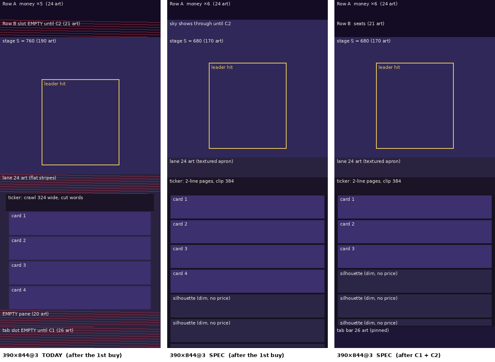
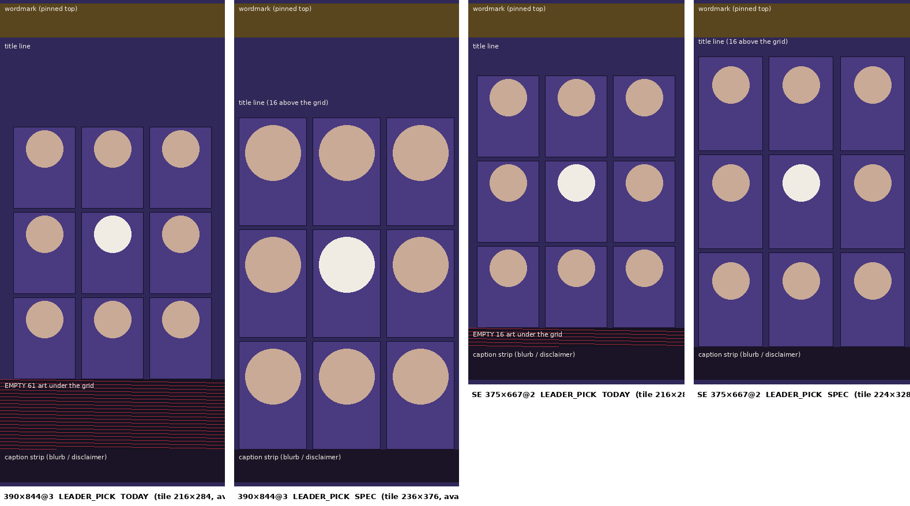

# "עוד סבב": mobile-first layout (`hud-layout` + `localization-layout-spec`, engine-concrete)

**Owner:** UX Designer · **Consumers:** Game Developer (implements after the picker merge), 2D Artist (§10 asks), Animator (the ticker page transition, §5.2), Game Designer (the silhouette rows, §4.4) · **Date:** 2026-09-29 · **Built against:** `claude/magical-ride-ntn3u5` with the picker merged (`ui/views/view_pick.gd`, `ui/leader_ui.gd`).

**Why:** Bar: "the mobile layout isn't good; it must be mobile first." The game is laid out as a fixed 720-logical (180-art) column, centred, with a flex rule that grows the stage and leaves reveal slots empty. On real phones that wastes 15-20% of the screen.

**Supersedes:** `rtl-map.md` §1 (the flex rule), §5.2 (the crawl), §8.2-§8.3 (the picker's vertical placement and tile width). **Amends:** `rtl-map.md` §2 (the counter scale), §6.1 (the pill), §6.2 (the tab slots), §7.1 (modal width and placement). Everything else in `rtl-map.md`, `ftue.md` and `screen-graph.md` §0 stands: the RTL rules, the reveal order, the red lines, the name "ביבי".

**Revision 2026-09-30 (UX review 2, `ux/review-2026-09-30.md`):** §5.2 takes the Animator's roll and dwell (D47, D48); new §5.2.1, the no-break (glue) rule (D49); new §5.14, the v4 civic pieces' placement (F15, D50); asks T1, A4, A5, M3, G2, D1 in §10.

**Revision 2026-09-30 (manual test pass, `HANDOFF.md` A2, A3, A7, B10, B12; UX Designer + Game Developer, pre-tap + HUD slice):** §3.3 and §5.9, the pre-tap screen is the round's screen before its first tap: Row A (with the new identity chip) and card 1 over the teaser rows are up from the pick, and the plaza is one 84-px strip in the still-free ticker slot (A2, D51); new §5.1.1, Row A's identity chip, the leader's face and short name at the right end, which replaces the round-start name toast over the stage, and the Cottage Index moves one slot left (A7, B10, D52); §5.8.1, the picker's caption on a full-bleed navy plate (A3, D53); §5.9, the pre-tap undo chip in a navy bar in the ticker slot (B12, D54); §9.1 adds S13-S16. Shots: `ux/manual-test-2026-09-30/fixes/dev2-*`.

**Reference implementation of every number here:** `ux/tools/mobile_layout.py` (the tables in §2-§5 are its output). **Check:** `tools/web/mobile_web.mjs` (§9). **Wireframes:** `ux/mockups/mobile-first-*.png` (`ux/tools/mobile_mockup.py`).

---

## 0. The rules on one screen

1. **The scale is unchanged.** k = crisp(min(floor(W/180), floor(H/267))) on the backing store. On every portrait phone of the matrix the width binds, so k is already "chosen by width". What changes is what the engine does with the leftover: **the art grid is `floor(W/k)` columns by `floor(H/k)` rows** (180-215 × 274-466 on the matrix), and the layout fills that grid instead of centring a 180 × 267 column in it.
2. **Chrome is fluid, the stage is centred.** Row A, Row B, the ticker, the cards, the tab bar, the tall tabs and the sheets span the whole canvas width `cw = floor4(vs.x)` (720-860 logical). Each element has an anchor (right, left, centre, stretch; §4). Only the stage art stays a centred 720 column, extended to the edges.
3. **Bottom-up vertical budget.** From the safe bottom up: the tab bar (26 art, pinned), the card pane (whole cards plus a 10-art peek), the ticker (21), the stage (the rest, ≥ 160 art when it can be), Row B (21), Row A (24), the safe top. Extra height buys **whole card rows**, never a taller stage, as long as the stage keeps its 160-art composition (§3.2).
4. **No reserved slot is ever an empty band.**
   - Row B's slot shows the stage sky until C2.
   - The card pane covers the tab bar's slot until C1.
   - The pane fills with dim silhouette rows of the sources still to come.
   - The Suitcase lane and the pre-tap floor get textured art.
5. **A cut card shows ≤ 40 logical px** (10 art: its top edge and the top of its name, never its pill).
6. **The ticker pages; it does not crawl.** Two lines, whole words, in a clip that grows with the width. No word is ever cut (§5.2).
7. **The money readout goes to ×6** (15 CSS px digits). The buy pill grows with the width and shows its price at ×5 when it fits (§5.1).
8. **The picker grid is bottom-anchored** in the thumb zone, with fluid tiles and the 192-logical avatar on every phone of the matrix but the SE (§5.8).



---

## 1. What is wrong today (verified at build `af18f9e` + the picker, 2026-09-29)

**Method:**
- The strict `tools/build_web.sh` export, served on :8815.
- `tools/web/mobile_web.mjs` (new, §9) at 390×844@3, 375×667@2 and the desktop frame: real touches, the picker, the first buy, C1, T3 and a paid demand, C2, settings.
- The orchestrator's four captures in `scratchpad/shots/mobile/`.
- Bands were measured on the pixels. A "band" is a run of rows where ≥ 98.5% of the samples (one per art px) are one colour.

| # | Observation (orchestrator) | Verified | What it actually is |
|---|---|---|---|
| V1 | Empty dark band under the list on tall phones (15-20%) | **Yes.** 390@3: logical 1504-1688 (46 art, 11% of H); 430@3: 73 art (16%); 360@3: 27 art (7%). | Two things. (a) **The pane is taller than its content.** The flex rule gives the pane P = 560 at 390@3 (4.7 rows), but after the first buy the list has 3 cards and 1 silhouette. (b) **The tab bar's slot (104) is empty until C1.** |
| V2 | "The list shows only 4 rows while the screen has room for more" | **Partly.** No cap: P holds 4.7 rows at 390 and 5.6 at 430. | Content-limited: 3 cards + 1 silhouette exist. The fix is to fill the pane (§4.4), not to raise a cap. |
| V3 | Dead band under the HUD | **Yes.** Logical 76/80-180 (25-26 art) on every phone, in the HUD fill #140c24. | Row B's slot, reserved and painted, with nothing in it until C2 (the first paid demand, ≈ 50-60 s). |
| V4 | Striped dead strip between the stage and the ticker | **Yes.** 24 art (logical 844-940 at 390; 724-820 at the SE). | **The Suitcase lane.** The kit tile `lane_<era>` is 2×28 px: horizontal stripes only, so every row is one colour. The stage art's own bottom 90 rows (below the apron lip at row 230) are flat `padBottom` #2a2340. |
| V5 | SE: the list is cut mid third card | **Yes.** 375×667@2 at C1: the third card shows 86 of 120 px, including half of its gold pill (a tappable half-button). | The flex rule sizes P from the height, not in whole cards. |
| V6 | Ticker truncates ("בע.", "יש כובע.") | **Yes.** At every size the clip (x 192-516 in the 720 column = 162 CSS px) shows fragments at both edges, e.g. "…נרכע" cut at the left while ", יש כובע." exits. | The crawl moves a median 928-px headline (49 characters) through a 324-px window. No headline fits the window (the shortest is 512 px), so every frame shows cut words. |
| V7 | Money readout and buy buttons small; HUD right side empty | **Yes.** The counter is ×5: 12.5 CSS digits, only 1.25× the 10-CSS body text. The pill is 184×88 logical (92×44 CSS). The HUD's right slot is the cottage cup, which appears at Q1 (1,000 ₪ lifetime, ≈ 1:30). | The hierarchy is weak, and the empty cottage slot is transient. |
| V8 | The bottom nav isn't visible early | **Expected by the FTUE:** tab slots 1 and 3 appear at **C1** (3 sources + 60 ₪, ≈ 40-50 s after the pick), slot 2 at **K3** (≈ 2:00-2:30), slot 4 at **K2** (≈ 3:00). | The slot stays reserved and empty until then (V1b). |
| **V9** (new) | — | The chrome is a 720 column: at 390 the ticker, cards and tab bar leave 30 logical (15 CSS) flat margins per side, and at 430 70 logical (35 CSS). The stage art (180 art) leaves flat `padBottom` side bands of 7.5 art (390) and 17.5 art (430). | Width is not used. |
| **V10** (new, orchestrator) | Picker: dead band under the 3 × 3 grid | **Yes.** 390×844: 65 art (logical 1316-1576) between the grid and the caption strip; the SE: 21 art. The avatars are L (128), in 216-wide tiles inside a 780 canvas. | `rtl-map.md` §8.2 said "the grid centred in what is left". The engine did exactly that. **The spec was wrong** (§5.8). |
| **V11** (new, orchestrator) | The round's first screen before tap 1 leaves the lower half empty | **Yes.** 390@3 pre-tap: logical 924-1688 is one colour (191 art, 45% of H), with only the undo chip in it. | The pre-tap state hides the ticker, pane and tabs by design (ftue P0), and paints the floor colour (R16). |

Shots: `scratchpad/shots/mobile-ux/` (`390x844@3-{pick,pretap,card1,bought,c1-tabs,t3-chat,c2-rowb,settings}.png`, the same for `375x667@2` and `frame-1440x900@1`; `overview-390.png`).

---

## 2. Device matrix and scale (portrait only)

**Scale (unchanged):** `Display.art_px_for` stays as it is. In portrait the `floor(H/267)` bound never binds on the matrix. It only binds on landscape and desktop windows (the frame is portrait by construction).

**New in `display.gd`** (exact):

```gdscript
static var cols := 180          # art columns: floor(W_dev / k)
static var rows := 267          # art rows:    floor(H_dev / k)

## in update(), right after nk / ni are computed and BEFORE the "unchanged" early return: two
## phones with the same k (390@3 and 430@3 are both k 6) differ only here. The fallback keeps
## 180 × 320.
cols = int(floorf(win.x / nk)) if ni else ART_W
rows = int(floorf(win.y / nk)) if ni else 320

## The layout width in logical px: whole art columns, on the 4-px grid (720 at 180 cols).
static func cw() -> float:
    return float(cols * ART_PX)
```

`L.W` (720) stays the **design width** of every rect in `rtl-map.md`. The engine adds `L.cw` (a static var set by `_relayout` from `Display.cw()`, clamped to ≥ 720) and `L.dx = L.cw − 720`. §4 says how each rect uses `dx`.

**The matrix** (`ux/tools/mobile_layout.py`; insets 0 unless named; logical px unless the column says CSS):

| Device | device px | k | CSS/art | logical | cw (Δ) | R | **S** | **P** | whole rows + peek | leader | stage top / lowerY / tabsY | leader hit centre · bottom, CSS y (% of H) | list CSS y | 88 logical = CSS |
|---|---|---|---|---|---|---|---|---|---|---|---|---|---|---|
| SE 375×667@2 | 750×1334 | 4 | 2.0 | 750×1334 | 748 (+28) | 964 | **564** | **400** | 3 + 40 | ×4 | 180 / 744 / 1228 | 198 (30%) · 302 (45%) | 414-614 | 44.0 |
| 390×844@3 | 1170×2532 | 6 | 2.0 | 780×1688 | 780 (+60) | 1320 | **680** | **640** | 5 + 40 | ×4 | 180 / 860 / 1584 | 256 (30%) · 360 (43%) | 472-792 | 44.0 |
| 393×852@3 | 1179×2556 | 6 | 2.0 | 786×1704 | 784 (+64) | 1336 | **696** | **640** | 5 + 40 | ×4 | 180 / 876 / 1600 | 264 (31%) · 368 (43%) | 480-800 | 44.0 |
| 430×932@3 | 1290×2796 | 6 | 2.0 | 860×1864 | 860 (+140) | 1496 | **736** | **760** | 6 + 40 | ×4 | 180 / 916 / 1760 | 284 (30%) · 388 (42%) | 500-880 | 44.0 |
| 360×780@3 | 1080×2340 | 6 | 2.0 | 720×1560 | 720 (+0) | 1192 | **672** | **520** | 4 + 40 | ×4 | 180 / 852 / 1456 | 252 (32%) · 356 (46%) | 468-728 | 44.0 |
| 412×915@2.625 | 1081×2401 | 6 | 2.286 | 720.67×1600.67 | 720 (+0) | 1232 | **712** | **520** | 4 + 40 | ×4 | 180 / 892 / 1496 | 311 (34%) · 430 (47%) | 558-855 | 50.3 |
| frame 390×844@1 | 390×844 | 2 | 2.0 | 780×1688 | 780 (+60) | 1320 | **680** | **640** | 5 + 40 | ×4 | 180 / 860 / 1584 | 256 (30%) · 360 (43%) | 472-792 | 44.0 |
| frame 390×844@2 | 780×1688 | 4 | 2.0 | 780×1688 | 780 (+60) | 1320 | **680** | **640** | 5 + 40 | ×4 | 180 / 860 / 1584 | 256 (30%) · 360 (43%) | 472-792 | 44.0 |
| 390×664@3 Safari bars | 1170×1992 | 6 | 2.0 | 780×1328 | 780 (+60) | 960 | **560** | **400** | 3 + 40 | ×4 | 180 / 740 / 1224 | 196 (30%) · 300 (45%) | 412-612 | 44.0 |
| SE 375×548@2 Safari bars | 750×1096 | 4 | 2.0 | 750×1096 | 748 (+28) | 728 | **460** | **268** | 2 + 28 | ×3 | 180 / 640 / 992 | 172 (31%) · 250 (46%) | 362-496 | 44.0 |
| 360×640@3 Chrome bars | 1080×1920 | 6 | 2.0 | 720×1280 | 720 (+0) | 912 | **512** | **400** | 3 + 40 | ×3 | 180 / 692 / 1176 | 198 (31%) · 276 (43%) | 388-588 | 44.0 |
| 393×852@3 home screen (insets 59 / 34 CSS) | 1179×2556 | 6 | 2.0 | 786×1704 | 784 (+64) | 1148 | **748** | **400** | 3 + 40 | ×4 | 300 / 1048 / 1532 | 350 (41%) · 454 (53%) | 566-766 | 44.0 |

**What the table guarantees:**
- **One art px is ≥ 2 CSS px on every phone of the matrix,** so the 88-logical touch floor (`rtl-map.md` §0) is ≥ 44 CSS pt everywhere (50 at the 2.625 DPR).
- **The desktop frame at @1 and @2 gets exactly the 390×844@3 layout** (the same logical canvas).

**The non-integer DPR (412×915@2.625):**
- The shell already sizes the backing store to `floor(CSS × DPR)` = 1081×2401. The canvas box is 411.81 CSS px, so the browser composites 1:1: no resample, `cols` 180, `rows` 400.
- The last 0.67 logical px of width and height are the aspect-`expand` remainder.
- **Rule:** every full-bleed fill (`_fills`, the ticker panel, the tab bar plate) is sized to `vs.x`/`vs.y` (not `cw`), so no 1-px seam shows at the right or bottom edge.

**Out of the matrix, by decision:**
- 320-CSS phones: 640 device px gives k 3 and 1.5 CSS per art px, so the 44-pt floor fails.
- Landscape.
- Tablets: they get the frame's rule only when a fine pointer is present. A portrait tablet gets the phone layout at its own k.

---

## 3. Vertical budget

### 3.1 The stack (screen-logical, top → bottom)

| Region | Height | Rule |
|---|---|---|
| Top inset | `ins_t` = ceil4(safe top) | The Row A fill continues under it |
| **Row A** | 96 (24 art) | Fixed |
| **Row B** | 84 (21 art) | Fixed slot. **Before C2 its fill is not drawn: the stage sky shows through** (§3.3) |
| **Stage** | `S` | §3.2; bottom-anchored content (leader, lane, thermometer) as today |
| **Ticker** | 84 (21 art) | Fixed |
| **Card pane** | `P` | §3.2: whole cards + a peek. **Before C1 it runs to the safe bottom** (`P + 104`) |
| **Tab bar** | 104 (26 art) | **Pinned: its bottom = `vs.y − ins_b`**, always. It slides up over the pane at C1 |
| Bottom inset | `ins_b` = ceil4(safe bottom) | The tab bar's fill continues under it |

Fixed = 368, and `R = floor4(vs.y) − ins_t − ins_b − 368` is shared by the stage and the pane.

### 3.2 The split (replaces `L.flex`)

```
CARD = 120, PEEK = 40, S_PREF = 640, S_FULL = 560, S_MIN = 460
n = max(3, floor((R − S_PREF − PEEK) / CARD))   if R − (3·CARD + PEEK) ≥ S_MIN
  = 2                                            otherwise
while n > 3 and (ins_t + 180 + (R − n·CARD − PEEK) − 140) < 0.40 · floor4(vs.y):   # reach guard (§6)
    n −= 1
P = n·CARD + PEEK;   S = R − P
if S < S_MIN:  S = S_MIN;  P = R − S          # the floor viewport: the peek shrinks (28 at 375×548)
leader art ×4 when S ≥ 560, else ×3 (rtl-map §4, unchanged)
```

**In words:**
- The stage keeps its designed 160-art composition (`S_PREF`) and takes the remainder (< 30 art), which is all sky above a bottom-anchored leader.
- Every further 30 art of height buys one more whole card row.
- Short viewports keep 3 rows as long as the stage can stay ≥ 460. The leader goes ×3 under 560, as today.
- The pane always ends in a 40-px peek when the list overflows: the top edge of the next card and the top of its name. That is the scroll signifier, and it never shows the pill.

**Result vs today** (whole card rows visible once the tab bar is up):

| | SE 375×667 | 390×844 | 393×852 | 430×932 | 360×780 | 412×915 | 390×664 bars | 375×548 bars |
|---|---|---|---|---|---|---|---|---|
| Today (flex rule) | 2 + 86 cut (pill half shown) | 4 + 80 cut | 4 + 92 cut | 5 + 68 cut | 4 + 4 | 4 + 29 | 2 + 80 cut | 2 + 0 |
| **Spec** | **3 + 40** | **5 + 40** | **5 + 40** | **6 + 40** | **4 + 40** | **4 + 40** | **3 + 40** | **2 + 28** |
| Before C1 (pane to the bottom) | 4 + 24 | 6 + 24 | 6 + 24 | 7 + 24 | 5 + 24 | 5 + 24 | 4 + 24 | 3 + 12 |

### 3.3 Reveal states: nothing reserved is empty

| State | Today | Spec |
|---|---|---|
| **Pre-tap** (after the pick, before tap 1; ftue P0) | *(2026-09-30 manual test A2: the plaza filled the whole lower half, about 45% of the screen, with no content, hint or card.)* | **Rev 2026-09-30 (D51): the pre-tap screen is the round's screen before its first tap.** From the pick: **Row A** (the identity chip §5.1.1, mute and settings; the counter still comes at H1), the stage, then **the ticker slot as one 84-px strip of the plaza floor** (the diorama's plaza + the paving; the only stone left), then **the pane: card 1, dim (its pill at 40%), over the teaser rows**, to the safe bottom on the white field. **Nothing interactive moves:** the leader stays where tap 1 will find him, and card 1 is where it will be. For the first 5 s the undo chip sits in a navy bar over the strip (§5.9, B12). |
| **Tap 1 → 2** | The ticker appears (H1) | The ticker fades into the strip's slot (the same 84 px, the same navy as the undo bar); the counter fades into Row A. The pane was already up, so nothing else changes. (Supersedes review U3's "white field with card 1": card 1 is now up from the pick.) |
| **Card 1** (tap 3 on the fork's content) | The pane slides up with one card over an empty pane | With leader select, card 1 is already up (above). On content without leader select the fork's tap-3 slide-up stands. Card 1's pill stays the only lit object in the pane: it goes gold at 15 ₪ (P1), so first-minute's "one card, one price" holds. |
| **First buy → C1** | Empty pane below the cards; an empty tab slot | Pane full to the safe bottom |
| **C1** | The tab bar appears in its slot | **The tab bar slides up from the screen bottom over the pane's last 104 px** (the pane's clip shrinks by 104). Nothing above moves; the list keeps its scroll offset. |
| **Before C2** | Row B's slot painted #140c24, empty (25 art) | Row B's slot is **not filled**: the diorama sky, already drawn behind it (`diorama.extend`), shows through. `_fills["top"]` height = `ins_t + 96` (not `+ 180`). The toast dock and the stage items keep their screen positions. |
| **C2** | Row B appears | Row B's fill fades in (150 ms; reduced motion: instant) with the seats, as the pips land. Nothing moves. |
| **After an election** | The `ui` flags persist | Unchanged: every slot is already revealed |

### 3.4 Toasts over the leader on short stages

At S < 640 the toast dock (stage-local y 8-96, or 8-140 for two lines) overlaps the top of the leader's hit by up to 92 px. **During a tap burst** (the last leader tap < 1 s ago), a toast's hit is disabled, so taps on it pass to the leader. The toast stays visible. A chat toast is opened from the tab badge or by tapping it after the burst. This extends ftue §3.1's "tap-burst rule" (no overlay auto-opens during a burst) to toast hits.

---

## 4. Horizontal: fluid chrome

`dx = cw − 720` (0-140 on the matrix). Every rect in `rtl-map.md` keeps its 720-design numbers; the engine applies one of five anchors:

| Anchor | Transform | Use |
|---|---|---|
| **R** (right) | `x + dx` | Everything first in RTL reading order: labels, plates, icons at the right edge |
| **L** (left) | `x` | Trailing items: pills, numerals, the gear/mute, the date chip |
| **C** (centre) | `x + floor4(dx / 2)` | Centred content: the counter, titles, modal cards, the stage column |
| **S** (stretch) | `x`, `w + dx` | Panels, tracks, clips, text boxes between an L and an R item |
| **F** (full bleed) | `0 … vs.x` | Background fills, the ticker panel, the tab bar plate, the lane |

Helpers in `L`: `ra(r)`, `ca(r)`, `sa(r)` return the transformed `Rect2`, and `rx(x)`, `cx(x)` do the same for a single x. `mx()` keeps mirroring across 720 (the design space) and is applied **before** the anchor.

### 4.1 Per region

| Region | R | L | C | S | F |
|---|---|---|---|---|---|
| **Row A** | the identity chip (face, name; §5.1.1), cottage hit/icon | gear, mute | counter, rate | counter box, rate box (`w + dx`) | fill |
| **Row B** | label "מנדטים" | numeral / blackout stamp | — | track (`x 144`, `w 424 + dx`), notches recomputed on the new width | hit (0 … vs.x), fill |
| **Stage** | — | thermometer (x 12: it is HUD-like and must not drift inward) | the 720 stage column (`stage_ox = floor4(dx/2)`): leader, props, diorama slots, cameo, Sara, buff chip, banner | toast dock (`x 16`, `w 688 + dx`; text box right edge `676 + dx`) | sky bands, lane, stage-art wings (2D ask A2) |
| **Suitcase** | enters at `x 760 + dx` | exits at x −104 | — | band `w 720 + dx` | — |
| **Ticker** | tag plate, Dubi (`anchor_layout` with `tagRight 700 + dx`) | date / court / press chip | — | crawl clip `x 192 … 516 + dx` (court 228, press 236) | panel |
| **Election CTA** | — | — | label | visual `Rect2(8, 2, 704 + dx, 80)` | hit |
| **Card** | plate, icon, owned badge, name and line 2 right edges | pill | — | card `Rect2(16, 0, 688 + dx, 120)`; name/line 2 boxes `w + dx − pill_growth` | — |
| **Buy-mode row** | label | button | — | row | — |
| **Tab bar** | — | — | icon and label per slot | 4 slots of `floor4(cw / 4)`, slot i at `x = cw − i·slot_w` (right → left); the remainder goes to slot 4 | plate |
| **T3 / T4** | header chevron, title, status right edge `616 + dx`; incoming avatar and bubble (right edge `568 + dx`); T4 row labels | player replies (`x 16`), the scrollbar | system pills, brawl slot, transfer banner | thread, composer, pinned bar, T4 rows | backgrounds |
| **Court / press card** | ✕ stays top-left (L); header, body, timer | primary button | — | card `w 688 + dx`; body boxes; primary `w 416 + dx` | — |
| **Modal card** | — | — | card, width `624 + min(dx, 64)` | body box `560 + min(dx, 64)` | scrim |
| **Sheet** | labels, switches' state text | switch visuals, ✕ | titles | rows, the bottom "סגור" | sheet plate (0 … vs.x) |

**Bubble and text measures do not grow past readability:** a chat bubble's text column stays ≤ 416 + min(dx, 64) (≤ 20 glyphs per line), and a modal body stays ≤ 624 (≈ 24 glyphs).

### 4.2 Budgets

- `string-budgets.json` boxes stay measured at 720, the worst case. A wider canvas only adds room, so no string can newly overflow.
- `gen_strings.py` needs no change.
- The lint's worst case is `dx = 0`: 360-wide phones and 412@2.625.

---

## 5. Screens

### 5.1 Main screen (HUD, cards)

**Row A** (24 art):
- **The counter goes from ×5 to ×6** (`TopBar.COUNTER_SCALE = 6`):
  - glyph ink: digits 5 font px, so 30 logical = **15 CSS**, 1.5× the body text; ₪ is 6 font px, so 36;
  - cell top at y 0, rate line at y 52 (×4, ink 56-92). Row A stays 96.
  - Worst "₪ 8.888mm" = 46 font px × 6 = 276 ≤ the 328 box. At dx = 0 the box, centred, runs x 196-524, clear of the mute hit (100-188) and the cottage hit (624-712).
  - ×6 is 1.5 art px per font px: whole device px at every even k (4 → 6 px, 6 → 9, 2 → 3), which is every phone of the matrix. On an odd k, `PxText.text_scale` snaps it.
  - **Rejected alternative:** ×8 would need Row A at 28 art, which costs the SE its ×4 leader.
- **The right end is the identity chip (§5.1.1, rev 2026-09-30).** Before it, the cottage slot was empty until Q1 (≈ 1:30) and B10 found Row A lopsided. The counter stays centred on the canvas, above the leader.

#### 5.1.1 The identity chip: the round's face and name at Row A's right end (A7, B10; D52)

**Why:** the round-start name toast (`LEADER_PICK_PLATE` in the toast dock, stage y 8-96) covered the top of the building at 390 and the leader's head on the SE (A7); and Row A's right end sat empty for round 1's first 90 s while the counter and the rate crowded the centre (B10, D22).

**What:** from the pick on (the pre-tap state included), Row A's right end shows the round's leader. Reading order right → left: **face · name · (counter, centred) · mute · settings**.

| Part | Rect (`_top`-local, anchor) | Content |
|---|---|---|
| Face | hit `Rect2(624, 4, 88, 88)`, medallion `Rect2(636, 16, 64, 64)`, **R** | The pick avatar (the lavender-ringed medallion) drawn at 16 art: the densest of `avatar_pick_<art>_d3` (96 px), `_d2` (64 px), `avatar_pick_<art>` (32 px) whose pixel count divides 16·k, so every sprite px is whole device px (k 6 → d3 at 1 dp, k 4 → d2 at 1 dp, k 2 → 32 at 1 dp). Not a target (no tap). |
| Name | right edge `624 + dx`, y 28, ×4, **R**, one line | `leaders[].short` in `w` #fff8ec. 8.8:1 on the flag blue. Widest today: סמוטריץ׳ 144 (box x 480-624 at dx 0). |
| Cottage Index | hit `Rect2(536, 4, 88, 88)` (was 624), cup at (548, 12), **R** | Unchanged behaviour (§2 of rtl-map: 50%, 100% for 3 s on a change). It **shares the name's slot**: the cup shows only when the name has yielded. |

**When the name shows** (a state predicate, never a timer): `a leader is set` and (`the Cottage Index is not revealed` **or** `the round has not started`: `run_taps == 0` and no source owned). So round 1 shows the name until Q1 (≈ 1:30), and every round start (after an election, when the cup is long revealed) shows the name until the first tap or buy, then it fades out (150 ms; reduced motion: a cut) and the cup takes the slot. The face stays for the whole round.

**Width guard:** the name also hides whenever the counter's or the rate line's drawn ink would come within 16 px of it (`TopBar.name_fits`). At dx 0 the widest name (144) starts at 480 and the counter's worst ink ("₪ 8.888mm" ×6) ends at 498, so only a 360-/412-wide phone with a late-game counter can trip it, and the face stays.

**HUD DOG (hud-design) per element:**

| Element | State surfaced | Tier | Update | Region | Taxonomy (why) | Fade rule |
|---|---|---|---|---|---|---|
| Face | who you play this round | informational (each leader has their own rule and hazard skin: the court vs the press) | low-frequency (once a round) | Row A right, R, inside the safe top | non-diegetic: the stage figure is the diegetic identity; the face keeps it on screen when T3/T4 cover the stage | none: informational; it changes only at a pick (a 200 ms fade-in with Row A) |
| Name | the leader's name (for players who do not know every face) | informational | low-frequency | Row A right, R | non-diegetic, as above | yields to the cup after the round starts (state predicate above) |
| Cottage Index | the Cottage Index | peripheral | event-driven | Row A, one slot left of the face | meta (a satire indicator) | its own rule, unchanged |

**Red line check (rtl-map §4.3):** the name is never on Row B's line and never beside a seat number: Row B's numeral is at the left end of another row (x 16-136), and before C2 Row B is not drawn at all. Row A holds money, not seats.

**Contrast:** name 8.8:1 (#fff8ec on #0038b8); the medallion's lavender ring 6.1:1 on the flag blue (a 3:1 non-text boundary).

**Row B:** as rtl-map §3 with §4.1's anchors. The label/numeral baseline stays at y 120.

**Cards** (rtl-map §6.1, amended):
- **The pill grows with the width:**
  - `pill_w = 184 + min(dx, 40)`: 224 at cw ≥ 760, which is every 375+ phone;
  - the pill text box is `pill_w − 16`;
  - the name and line-2 boxes shrink by the pill's growth, but grow by `dx`, so they never lose width against 720.
- **Price at ×5** when the filled `CARD_PRICE` fits the pill box at ×5 (the §0.2 step-down rule, applied always, not only in large text):
  - "₪ 110" ×5 = 115;
  - at 224 the worst "8.88mm ₪" ×5 = 205 fits;
  - at 184 (dx = 0) it steps down to ×4.
  - The verb line stays ×4.
- **Hit:** the whole card, 688 + dx × 120 (344-430 × 60 CSS), as today. The pill is the signifier, not the target.

### 5.2 The ticker: paged, two lines, never cut

Replaces rtl-map §5.2 (the crawl). The Animator's D16 cadence is retired with it; the page transition below is the Animator's to tune.

| Property | Value |
|---|---|
| Clip | `x 192 … 516 + dx` (324-464; court day 288 + dx, press 280 + dx) |
| Lines | **2**, at pitch 40 (the "tight UI" pitch): line 1 cell at y 2, line 2 at y 42, so the full ink including ascenders and descenders runs 6-42 and 46-82 in the 84 row. Right-aligned at the clip's right edge. The @2 reading cut, as today. |
| Paging | The headline is broken at spaces into lines ≤ clip width, then into pages of 2 lines. **A word is never split, and a glued unit is never split** (§5.2.1: a currency sign stays with its number, punctuation stays with its word). The widest word in the content today is "ההייטקיסטים" at 216, which is < 280, the narrowest clip. The lint (`content-lint.mjs`) adds: every ticker **unit** (§5.2.1, strong glue) ≤ 280 px at ×4. |
| Dwell | **Superseded by the Animator's M1 (accepted 2026-09-30, D48):** `Ticker.dwell_ms`, a first page 1.2 s + 70 ms a character, a continuation 0.5 s + 70 ms, clamped 2.0-5.5 s; an ftue line 1.5 s + 85 ms (continuation 0.5 s + 85 ms), clamped 4.5-7.0 s. (Was max(3.5 s, 55 ms × characters), under which every page sat on the 3.5 s floor.) |
| Transition | **A vertical roll (the Animator's M1, accepted 2026-09-30, D47; replaces the sideways push):** the next page rises from under the 84 row as the old one lifts out, locked one row (84) apart, 240 ms Cubic.Out in 4-px steps. **x never moves**, so every visible glyph keeps its word on every frame: only whole glyph rows cross the clip's top and bottom edges. Three conditions: (1) a roll always completes (a higher-priority headline waits the ≤ 240 ms, or cuts to its first page with no roll; never a half-rolled rest state); (2) a tap during a roll opens O6 on the **incoming** headline; (3) reduced motion: the existing 200 ms cross-fade, no roll. |
| Tap | As today: the row opens O6 while a headline shows |
| Large text | One line at ×5 (two ×5 lines are 100 > 84), paged the same way |
| Numbers (390 / 430 / 360) | 2-line pages per headline: mean 1.84 / 1.56 / 1.97, max 3 / 2 / 3 (measured on all 173 ticker lines in `content.json`). Today's crawl takes 15.6 s per median headline through a keyhole; paging takes ≈ 7 s, with every word still. |
| Publish | `window.odDisplay.ticker = {mode: "page", clipW, lines: 2}` (the check reads it) |

#### 5.2.1 The no-break rule (glue): a number keeps its sign, a word keeps its punctuation

**Seen** (Animator wave B, browser strip; reproduced on the content): the pager breaks "…הקופה עברה 100,000 ₪." before the shekel sign, so "₪." opens line 2 on its own. On the whole `content.json` (1,394 Hebrew strings, measured with `sevev9.fnt` at ×4), plain space wrapping opens a line with "₪", a closing mark or a bare magnitude word **18 / 20 / 14 / 11 times** at the 280 / 324 / 384 / 464 clips. With the glue below: **none at 324, 384 and 464, and one at 280**, where "850.6 מיליארד ₪." (288 px) is wider than the line and falls back to its weak joint. (A magnitude word used as a noun, "הקופה עברה מיליארד ₪.", may still open a line; that break is correct Hebrew.)

**The rule.** Before a text is wrapped (the ticker pager **and** every `PxText` that wraps: bubbles, toasts, modal bodies, captions), spaces inside a glued unit are replaced with U+00A0 (NBSP). `Ticker.wrap_lines_px` splits on U+0020 only, and TextServer's word-bound breaking does not break at U+00A0, so one substitution serves both paths. **All three shipped fonts (`sevev9`, `sevev9@2`, `sevev9_outline`) have U+00A0 with the space's advance (4 / 8 / 4)**, so no width, no line count and no string budget changes. The substitution is display-time only (never written into `content.json` or `ui-strings.json`), and it never touches an LRI/RLI/FSI/PDI isolate.

| # | Glue | Pattern (logical order) | Strength |
|---|---|---|---|
| G1 | The currency sign to what it measures | a space **before ₪** (`X ₪` becomes X, U+00A0, ₪, whatever X is: a number, `{price}`'s isolate close U+2069, or a magnitude word) and a space **after a prefix ₪** before a digit or an isolate (`₪ 15`) | **strong** |
| G2 | Closing punctuation to the word before it | a space before a token that is only `. , : ; ! ? … ) ] ״ " ׳ '` followed by a space or the end | **strong** |
| G3 | Opening punctuation to the word after it | a space after `( [ „` (and after an opening `"` / `״` that stands alone as a token) | **strong** |
| G4 | A number to its magnitude word | `<digits> אלף/אלפי/מיליון/מיליוני/מיליארד/מיליארדי/טריליון` | **weak** |

- **Strong glue never breaks.** Every strong unit in today's ticker lines is ≤ 280 px at ×4 (the narrowest clip); the lint keeps it so (below).
- **Weak glue breaks only when the whole unit is wider than the line**, and then only at its weak joint ("850.6 | מיליארד ₪." at 280), never before ₪.
- **Fallback (never lose text):** if a unit is still wider than the line (a future string), the wrapper breaks it at its NBSPs as if they were spaces, weak joints first. Nothing is ever ellipsised by the glue.
- **Where it lives:** one pure function `Bidi.glue(text: String) -> String` (or in `Strings`), called by `PxText` before shaping a wrapping text and by `Ticker.paginate` before `wrap_lines_px`. Test (`test_ticker_roll.gd` or a new `test_glue.gd`): (a) `wrap_lines_px(glue("הקופה עברה 100,000 ₪."), w, 4)` never returns a line that starts with "₪" for every w from the unit's width to 464; (b) over every ticker line in `content.json` at clips 280 / 324 / 384 / 464, no line starts with ₪ or a G2 mark and none ends with a G3 mark, except a weak-joint fallback; (c) `glue()` is idempotent and leaves isolates untouched.
- **Lint (`content-lint.mjs`, Game Designer):** every ticker line's strong units ≤ 280 px at ×4 (replaces "every ticker word ≤ 280").
- **Not in scope:** Hebrew prefixes (ב־, ל־, מ־) are already one word; the maqaf keeps its words together in ICU.

#### 5.2.2 The strip is never empty (D19, manual test pass 2026-09-30)

**Seen:** on Bar's iPhone and in the headless card-1 shot the row showed the "מבזק" plate, Dubi and the date over an empty clip. **Cause (engine):** when a headline's last page had dwelt and nothing was queued, the pager rolled an *empty* page node in; nothing refills it for most of the first minute, because `ticker.ambientFrom: "C1"` holds every ambient line until the group opens (and the ambient interval is 10 s after that). The FTUE lines H1-H3 each played once and left a blank strip behind them.

| Case (nothing queued) | The strip |
|---|---|
| Before the first headline (the row appears at H1) | The **standing line** `TICKER_IDLE` "מהדורה מיוחדת" (an election-night channel's lower third) |
| A whole one-page headline (flavor, milestone, ambient) has dwelt | It **holds**, still, until the next item rolls in over it, for at most `HOLD_MAX_MS` 15 s; then the standing line rolls in |
| A multi-page headline has dwelt | The standing line rolls in (its last page alone is a fragment: "הרע.") |
| An FTUE line has dwelt | The standing line rolls in (an instruction goes stale once it is done) |

- **Look:** one line, centred in the row at `ONE_LINE_Y`, right-aligned at the clip edge like a page, in **ui_mute** `#c9d6f2` (8.9:1 on ui_panel): a step under the headline's white, so a new headline still reads as news. The same roll (or the reduced-motion fade) as a page change; a roll still running is settled first, so condition (1) of §5.2 holds.
- **Budget:** `ticker.idle` = 280 px at ×4, one line (the press-day clip, the narrowest). "מהדורה מיוחדת" is 264. Overflow strategy: none needed (fixed string, lint-checked); a longer future line would fail `gen_strings.py`.
- **HUD taxonomy (hud-design DOG 1, 3, 5, 7):** the standing line is `peripheral`, non-diegetic, `event-driven` (it only enters when a headline leaves); it does not fade to nothing because an empty strip reads as broken (the defect itself), so its attention demotion is the muted tone and the absence of motion while it stands. Headlines keep their tiers.
- **Checks:** `test_ticker_idle.gd` samples every 16-ms frame of each path (boot, hold, hold-out, roll-over, multi-page, FTUE, reduced motion, court-day clip) and finds no blank frame. `window.odDev.ticker = {visible, text, idle, held}`; `mobile_web.mjs` asserts a non-empty strip at card 1, bought and C1.

### 5.3 Tab bar

- The bar is pinned to the safe bottom (§3.1), with 4 fluid slots (§4.1).
- Per slot: the icon 60×60 centred at `slot_w/2 − 30`, y 8; the label centred at y 64 (box `slot_w − 16`); the badge at the icon's top-left (RTL trailing), (icon.x − 16, 0).
- The hit is the whole slot, `slot_w × 104` (180-215 × 104 logical = 90-108 × 52 CSS).
- Slot order, reveal and badges are unchanged (ftue).

#### 5.3.1 Four slots, always (D21)

**Seen:** at C1 the bar showed two tabs and two empty slots, still framed by the kit's three baked dividers, so the bar read as broken. The plate's dividers also stretched with the 9-slice (1 art px became 1.08 at cw 780).

- **The plate** is drawn from the kit `tabbar`'s divider-free first column (`region_rect` 0-39 × 26: the white-over-flag rules, no divider).
- **Dividers:** the engine draws one per slot boundary (x = cw − i·slot_w, i 1-3), 4 × 64 logical (the kit's rows 5-20), in the kit's divider colour, always whole art px.
- **A slot not yet revealed is a locked slot**, not an empty one: its own tab icon as a silhouette in ui_bubble `#1045b5` on ui_panel (1.6:1, deliberately quiet: WCAG 1.4.11 exempts inactive components) and the kit padlock `chat_icon_lock` (×4, dimmed toward ui_mute) where the label would sit. **No label**: the tab's name stays its reveal (ftue K2/K3). It is **not a target**: the bar swallows the press, nothing opens, no sound. The state is carried twice (silhouette + padlock), never by colour alone.
- **IA (information-architecture DOG 1, 3, 8):** the pattern stays hub-and-spoke with four fixed spokes; a locked slot has no edge, so it adds no node, no dead end and no modal; the player's location is still the one lit slot.

### 5.4 T1 sources and T2 spins (the list)

- **Silhouette rows (fill the pane):**
  - After card 1's reveal, the pane draws, after the real rows, one **silhouette row** per source not yet revealed. These rows are:
    - the kit `card_row` at 50% opacity;
    - the plate with the `nophoto`-style silhouette icon;
    - `ROW_LOCKED_NAME` "מקור עלום" on the name line;
    - **no price, no pill, not a target**.
  - The first locked source keeps today's rule: it is a real row with its price visible (`producerReveal.showNextAsSilhouette`).
  - The silhouettes stop at the content's last source: 8 at launch. That is enough on every phone of the matrix (the most rows are 7 + 24 px before C1 at 430).
  - **B9 (manual test pass 2026-09-30): the rows are not identical.** Five or six pale "מקור עלום" slips read as filler. Teaser j (0-based, after the priced locked row when there is one) draws at opacity `max(0.2, 0.62^j)`: the first is the whole pale slip and carries the only text, `ROW_TEASER_HINT` "עוד מקורות ייפתחו" on its name line (ui_panel on the slip, 8.9:1; box `card.name` 360); every later slip is **wordless** and fades down the pane, each with its own source's pale silhouette. **Why not only one or two rows** (the handoff's first option): below them the white field would open an 8+ art band with nothing in it, which §0 rule 4 and `mobile_web.mjs`'s dead-band check forbid for good reason (it reads as an unfinished screen); a slip at 0.2 still paints its face and edge (Δ ≥ 16 per pixel against the field), so the pane stays filled while the eye reads one hint and a fade.
  - **Ask to the Game Designer (G1):** add `producerReveal.fillSilhouettes: true` so this is a content decision, not a view default.
- **Buy-mode row** (B1): row 0 as today, full width.
- **T2 spins:** the same card geometry, the same peek rule. The spin list is long (15 lines), so it always overflows and needs no silhouettes.
- **Scrolling:** the peek (§3.2) is the signifier. The scroll track stays at the left (`x 4`) in both the pane and the tall tabs.

#### 5.4.1 The ruled margin (D20)

**Seen:** the 4-art gutter showed the white field as thin strips beside the blue cards, and the grey scroll thumb as a line at the far left: on the phone it read as a rendering gap.

**Chosen: an intentional margin, not full bleed.** The white field is palette v4's (Bar approved: "the cards sit on it like blue envelopes", style guide §2.4); making the pane edge-to-edge blue would drop the flag's white from the main screen. So the gutter becomes a **ruled margin**, the way v4 already treats its printed notices ("white notices ruled in flag blue"):

| x (logical, from each canvas edge) | Draws |
|---|---|
| 0-4 (1 art) | a **flag-blue rule** `#0038b8` (8.5:1 on the field), the pane's full height; on the right it also covers the < 4 px aspect remainder |
| 4-16 (3 art) | the white field |
| 16 … cw − 16 | the cards (unchanged, 688 + dx) |

- The rule meets the ticker's flag rule above and the tab bar's plate below, so the white field sits inside a blue frame and reads as a sheet, not a gap.
- **The scroll thumb** is ui_panel, 12 × (≥ 48), at x 0 (it rides the left rule and never reaches the cards), shown only while the list moves (drag, momentum, wheel) and **hidden when idle**. The resting scroll signifier is the 40-px peek (§3.2).
- **The width rule holds unchanged:** cards keep ≤ 4 art px of gutter per side (`mobile_web.mjs`, commented), and the edge columns never show the background.

### 5.5 T3 coalition chat (tall tab)

- `H_T = S + 84 + P`, from Row B's bottom to the tab bar: 1048 (SE) … 1580 (430).
- The thread is `H_T − 248`: 800-1332 logical, roughly 4-7 two-line bubbles.
- Full width per §4.1; the composer stays at the bottom, directly above the tab bar, in the thumb zone.
- **Golan's "לאחד" (the orchestrator's question): the partner card is the right *second* entry, and it is not enough on its own.**
  - **Why the partner card is right:** the merge is a relation between members, and the partner card is a member's home. The engine's pill there is correct: kit `button_secondary`, "לאחד" / "איחוד · N שנ׳" in the cooldown, disabled when no pair qualifies, opening the `MergeCard` pair prompt (a bottom sheet, which is right for reach).
  - **Why it is not enough:** it is Golan's signature rule, and the only path to it is tapping an avatar, which the FTUE never teaches. A player who never opens a partner card never meets the rule.
  - **Add a thread entry**, the same pattern as `CHAT_SYS_REJOIN` / `CHAT_SYS_POACH`:
    - When `Coalition.merge_candidates` first becomes non-empty with the cooldown at 0 (and again after each cooldown, at most once per 120 s), post a system pill `CHAT_SYS_MERGE_READY`, then the `CHAT_PILL_MERGE` pill under it: visual 512×68, hit 536×88, centred.
    - Proposed copy: "{a} ו{b} יכולים להתאחד" (UX writes the key with the next strings pass; ≤ 568 at ×4, `chat.sys`).
    - The pill opens the same `MergeCard`, with that pair pre-selected first.
  - **Hit:** the partner-card pill is 328×68 grown by (12, 10, 12, 10) = 352×88, which meets the pill floor (rtl-map §10) as built. Keep it C-anchored in the card.

#### 5.5.1 A short thread starts at the top (B11)

**Seen** (`04-chat-390.png`): a new group's three rows sat at the bottom of a 1,300-px blue field, and the player's one-word reply ("העברתי.") floated alone at the left edge like a chip.

- **Anchoring:** while the thread is shorter than its viewport it starts **under the pinned bar**, top-down, like any new conversation; once it overflows, the stick-to-bottom scroll takes over unchanged (the newest message stays at the bottom, rtl-map §6.3). The composer and the thumb zone are unaffected; the empty area, when there is one, is below the last message, where the next one will land.
- **The day chip:** the thread opens with `CHAT_TODAY` "היום" (the messenger convention; the string and its `chat.divider` box were already specced) on the navy system pill with ui_mute text (12.9:1), centred, the system pill's metrics, then the usual 24 gap. The empty thread (T3 before the group) keeps its single `CHAT_EMPTY` line.
- **The reply's row:** the first reply of a run is headed by the round's leader's short name (`LeaderUi.short()`, C_NAME `#c9d6f2`, 8.9:1), left-aligned at x 20 over the bubble, 44 above it: the partners' name-over-bubble, mirrored. The bubble keeps rtl-map's x 16. A run of replies names the first only.
- **RTL actions (localization-aware-layout DOG):** day chip `keep` (centred); reply name `mirror` (the partner name's right edge ↔ the reply's left edge); the thread's direction `keep` (top-down in both).

### 5.6 T4 dossier (tall tab)

- Rows are 88 tall and full width; labels are R-anchored at `688 + dx`.
- The full-width buttons (the receipt, the result card, the pardon row, the story) are hit `688 + dx × 88`.
- The "ראשי רשימה" section's avatar24 sits at ×2 at the right.
- The same height as T3.

### 5.7 Court / press card (O2)

- `Rect2(16, y0, 688 + dx, 356)`, bottom-anchored to the tab bar.
- With the spec's P (≥ 400 wherever S ≥ 560), the card sits **inside the pane** on every phone of the matrix except 375×548 (P 268: it extends 88 px over the ticker, as rtl-map §6.4 allows).
- The primary button (L) is `416 + dx` wide, the secondary (R) 224; both are ≥ 104 tall. The card sits in the thumb zone on every device.

### 5.8 `LEADER_PICK` (replaces rtl-map §8.2-§8.3 placement; everything else in §8 stands)

**What's wrong (V10):**
- The grid is centred in the leftover height (a 65-art band under it at 390×844).
- The tiles are fixed at 216 in a 780 canvas.
- The avatar tops out at L (128) on a phone with room for more.

**Vertical (safe band `top … bot`, `H = bot − top`):**

| Block | Rule |
|---|---|
| Wordmark (first launch) | **Pinned** at `top + 12`: `wordmark` when H ≥ 1280, else `wordmark_small`, C-anchored |
| Caption strip | **Pinned** above the foot: box `x 32 … 688 + dx`, 2 lines, the reading cut, 12 above and 12 below. Its last line's ink is ≤ 28 above the foot. |
| Foot | first: 16; after: the again button, `Rect2(24, bot − 100, 672 + dx, 80)`, hit `Rect2(16, bot − 104, 688 + dx, 88)` |
| **Grid** | **Bottom-anchored:** its bottom = strip top − 12 |
| Title line (+ the fresh chip after an election) | **Attached to the grid:** the title's cell bottom is 16 above the grid's top. The chip goes between the title and the grid (8 + 56 + 16). The title names the choice, so it belongs to it. |
| The space between the wordmark and the title | **The scrimmed stage.** It is the exempt "sky": the stage the leader is about to walk onto. On the matrix it is 0-268 logical. |

**Tiles (3 × 3 at n = 8; the 2 × 2 of wave 1 follows the same rules):**

```
tw  = floor4((cw − 32 − 40) / 3)              # 216 (dx 0) · 224 (SE) · 236 (390/393) · 260 (430)
x   = right: cw − 16 − tw,  centre: floor4((cw − tw) / 2),  left: 16      (reading order right → left)
avail = H − header − strip(112) − foot        # header = 12 + WM + 12 + 44 + 12 (first) or 12 + 44 + 8 + 56 + 12 (after)
A   = the first of [192 (even k only), 128, 96, 64] with A + 24 ≤ tw and 3·(156 + A) + 24 ≤ avail
th  = max(156 + A, min(floor4((avail − 24) / 3), floor4(1.6 · tw)))
      # the tile grows to fill, up to a 1.6:1 portrait card; the content block (A + 8 + 44 + 80)
      # is centred vertically in it
2 × 2: tw2 = floor4((cw − 48) / 2), the הפתעה bar Rect2(16, y, 688 + dx, 96)
```

**A = 192** is the new XL avatar:
- the 32-px pick avatar at ×6: 1.5 art px per sprite px, whole device px at every even k;
- **2D ask A3:** a d3 `avatar_pick_<art>` at 96×96, drawn at 2 logical per sprite px, which is crisp at every even k and matches the stage cast's d3 pixel size;
- until it lands, the d1 avatar at ×6.

**Resolved** (first launch / after an election):

| Device | cw | tw | first: avail / A / th / sky above the title | after: avail / A / th / sky |
|---|---|---|---|---|
| SE 375×667@2 | 748 | 224 | 1008 / 128 / 328 / 0 | 972 / 128 / 316 / 0 |
| 390×844@3 | 780 | 236 | 1364 / **192** / 376 / 212 | 1328 / 192 / 376 / 176 |
| 393×852@3 | 784 | 236 | 1380 / 192 / 376 / 228 | 1344 / 192 / 376 / 192 |
| 430×932@3 | 860 | 260 | 1540 / 192 / 416 / 268 | 1504 / 192 / 416 / 232 |
| 360×780@3 | 720 | 216 | 1236 / 192 / 348 / 168 | 1200 / 192 / 348 / 132 |
| 412×915@2.625 | 720 | 216 | 1276 / 192 / 348 / 208 | 1240 / 192 / 348 / 172 |
| frame 390×844 | 780 | 236 | = 390×844@3 | = 390×844@3 |
| 390×664@3 bars | 780 | 236 | 1004 / 128 / 324 / 8 | 968 / 128 / 312 / 8 |
| 375×548@2 bars | 748 | 224 | 824 / 96 / 264 / 8 | 736 / 64 / 236 / 4 |
| 360×640@3 bars | 720 | 216 | 956 / 128 / 308 / 8 | 920 / 128 / 296 / 8 |

The tile hit is the whole tile: 216-260 × 236-416 logical, ≥ 108 CSS on the short side.

**Unchanged:** the order, bloc balance, הפתעה in the centre, the strip, the commit feedback, the undo chip, the keyboard and a11y rules (rtl-map §8.3.1-§8.8).

**Publish:** `window.odPick.tile = [tw, th]` and `window.odPick.grid = [top, bottom]` (the check reads them).



**Leader card (§8.7):** a modal card, width `624 + min(dx, 64)`; the ✕ hit 104; the button full width at the bottom, which is the thumb zone. It is centred per §5.10.

**The undo chip** (§8.6): after an election its visual `Rect2(16, S−96, 392, 80)` is L-anchored in the lane, unchanged. Pre-tap it moves to the ticker slot's navy bar (§5.9, B12).

#### 5.8.1 The caption strip's plate (A3; D53)

**Why:** the strip's white text ("בכל סבב בחירות אפשר להחליף ראש רשימה. הבסיס נשאר.", or the disclaimer) sat straight on the light plaza stone, and the stone's joints ran behind the letters (`09-picker-after-election-390.png`).

**What:** the strip's whole box (`STRIP_H` 112, from the strip top to the foot) is a **full-bleed navy plate** (**F**, `#072a7a`, the ticker's panel colour, "like the ticker"). The text (×4, the reading cut, up to 2 lines) **hugs the text**: the plate is `44 · lines + 24` tall (112 for two lines, the whole strip box; 68 for one, centred in the box), the cell top 20 below its top, so the ink (rows +4 … +24 of the ×4 cell) has 24 of navy above and below, and centred on the canvas as before. #f7f4ec on #072a7a is **11.8:1**. The plate ends where the foot begins: the again button (white) stays on the stone below it, so the two never merge. The booth (§5.14.2) keeps its 8 px of stone above the plate. `window.odPick.strip` = the plate `[x, y, w, h]`, `odPick.stripText` = the text's `[top, bottom]` (S13).

### 5.9 Pre-tap stage (V11; rev 2026-09-30, A2 + B12)

See §3.3: from the pick, Row A (the identity chip, mute, settings), the stage with the leader where tap 1 will find him, the ticker slot as the plaza strip, and card 1 (dim) over the teaser rows. **First-minute's "one moving, glowing object" still holds:** the leader pulses (P0) and card 1 is dim, the teaser rows have no price, and Row A is quiet chrome. The screen now answers the two questions a new player has before tap 1 (who am I playing, and what am I tapping for) without a word of instruction: the face and name, and one card with one price.

**Mute and settings work before tap 1** (Row A is up): neither counts as tap 1.

**The undo bar (B12):** before tap 1 the ticker slot is free, so the undo chip sits there instead of floating on the stone:
- a full-bleed navy bar (**F**, `#072a7a`, the ticker's panel colour: at H1 the ticker takes the same slot in the same navy), 84 tall;
- the chip (kit `button_secondary`, `LEADER_PICK_UNDO`) centred (**C**): visual `Rect2(floor4((cw − 392) / 2), 8, 392, 64)`, hit 408 × 88 (y −2 … 86);
- the timer: a 2-art-px (8) line along the bar's bottom edge, full bleed, draining left → right (`mirror`) over `undoSec`; reduced motion: no line;
- it lives exactly as the chip does (§8.6: 5 s, until the first tap or buy); when it goes, the plaza strip shows until H1.
- Contrast: the label 6.8:1 on the chip face; the chip's light top rim 3.8:1 on the bar.

After an election the ticker is live, so the chip stays in the lane (§5.8).

**Open (accepted per §3.4, not in this slice):** on short stages (S < 560, the SE) Dubi's pre-tap chat toast (U9, ≈ 0.9-4 s after the pick) still sits over the leader's head in the toast dock. Proposed next: while Row B is not revealed, dock the toast in Row B's empty slot (84 px higher), so it covers ≤ 48 px of the stage top.

### 5.10 Modals (O1, O3, O6, O10, O11/O12, O15, the leader card, the partner card, the aide confirm)

- **Width:** `624 + min(dx, 64)`, C-anchored.
- **Height:** grows with content, as today.
- **Vertical placement, mobile-first:**
  - on canvases with a safe height ≤ 1400 logical, centred as today (`_ovl_y`);
  - on taller ones, the card's **centre sits at 55% of the safe height** (not 50%), so its button row lands in the lower half: O10's buttons move from 56% to ≈ 61% of H at 390×844.
  - Never closer than 24 to the tab bar's top.
- Button rules (side by side vs stacked) are unchanged. Stacked commit-over-cancel puts the cancel nearest the thumb, which is right for destructive modals.

### 5.11 Sheets (O7 settings, the coalition agreement, `MergeCard`, `SheetCard`s)

- Full bleed (0 … vs.x).
- **Height:** `min(content, floor4(0.70 · vs.y))`, as today (settings: 1072 content → no scroll at 390×844 and larger; it scrolls at the SE and the "bars" viewports).
- The bottom "סגור" is full width, `Rect2(24, h − 112, 672 + dx, 88)`, fixed.
- Rows use §4.1's sheet anchors.

### 5.12 Share cards (O4 receipt, O5 result)

- **The sheet may use the full safe height** (`vs.y − ins_t`, not 0.8 · vs.y): sharing is a focused task, and the preview is the product.
- **Preview scale:** `a` = the largest value with `a · f` whole, `216a ≤ cw − 32` and `270a ≤ sheet − 520`:

| Device | SE | 390 / 393 / 430 | 360 / 412 | frame @1 / @2 | 390×664 | 375×548 |
|---|---|---|---|---|---|---|
| a | 3 | 3.333 | 2.667 | 2 / 3 | 2.667 | 2 |

  At 390×844 the preview is 720×900 logical (360×450 CSS). The receipt's 1-card-px text is then ≈ 8 CSS: a preview of the image, legible enough to check before sending.
- **Button order, bottom-up** (thumb first): "סגור" (fixed); **"לשתף בוואטסאפ" full width** (Bar: WhatsApp is the main channel, so it is the nearest action); "לשתף" and "לשמור תמונה" side by side above it; the status line above them. This swaps today's order of the WhatsApp row and the side-by-side pair.

### 5.13 Full-screen moments (EVOLVE_TX, O3b flash)

- They are full bleed. Their content is C-anchored, at integer art scale as today (the flash's ×4 at k 6 and ×3 at k 4 are unchanged).
- The flash's stacked `FLASH_NEXT` over `FLASH_SKIP` (rtl-map §7.2) is bottom-anchored to the safe bottom (the skip's bottom 24 above it), full width `672 + dx`, in the thumb zone.

### 5.14 The v4 civic pieces: where the hemicycle, the booth and the envelope go (F15, 2026-09-30)

Bar approved palette v4 with three pieces drawn but not placed (style guide §2.4, §16 F15). The Game Developer measured the room (STATUS 2026-09-30). **Decision, in one line:** the hemicycle lives **only in the election card (O3)**; the booth frames the **picker grid wherever it costs no tile pixel**; the envelope goes **on the result card's stage floor and the share sheet's "sent" line**. Everything else keeps what it has.

| Piece | Goes | Does not go | Why |
|---|---|---|---|
| `hemicycle_track` + `hemicycle_fill` (72×38) | **O3, every device class, at ×4** (288×152 logical) when the card still fits (below) | **Row B** (the bar stays, every device); **the result card O5**; the picker; T3 / T4; EVOLVE_TX | See §5.14.1 |
| `booth_frame` (40×40, 9-slice [6, 10, 6, 4], content box [5, 9, 30, 28]) | **The picker (first and after), at ×4, on every viewport where it fits without shrinking a tile** (the tall phones and the desktop frame) | The SE, the toolbar viewports, and any viewport where it would cost tile height, tile width or the avatar size | See §5.14.2 |
| `envelope_blue` (14×10) | **O5's image**, on the stage floor; **the O4 / O5 share sheet's status line** after a share | Any blue surface (modals, sheets, buttons, T4 rows, the HUD); the chat; the receipt image | See §5.14.3 |

#### 5.14.1 The hemicycle: O3 only

**Row B keeps the bar on every device class.** At the only scale that fits the 84 row (×2, 0.5 art px per sprite px), each seat is a 2×2-CSS-px dot and the plate is 144×76 CSS: 120 dots cannot be told apart at arm's length, and the ×2 scale breaks the kit's rule that UI is drawn whole art px (k device px per art px). The bar is the glanceable readout (the fill, the 61 notch, the numeral), and it already survives the blackout (the numeral goes, the fill stays). At ×4 the hemicycle would cost a 152-logical row of stage on every phone, which the split (§3.2) gives back only by losing a card row.

**Not on the result card (O5), overriding the orchestrator's suggestion.** A filled 120-seat hemicycle beside a real party leader's face is exactly the TV seat-projection graphic that Israeli channels use for polls. O5 is the image people forward on WhatsApp, out of context. Two standing rules already forbid it: style guide §13 ("No seat numbers, ever", my UX 5 on the result card) and the red lines' `poll-number` rule (no seat count near a politician outside the in-game, blackout-aware HUD). A drawn count is a count. An *empty* hemicycle would carry no number, but it would only invite the question "why is it empty". The card keeps its stage and gets the envelope (§5.14.3).

**O3 (the election card), the hemicycle as the card's hero.** This is the ≥ 61 moment, private and in-game, and it is where the seat count means something ("you have a majority: call it").
- **Order** (`ElectionCard.build`, after `title()`): the title band → **the hemicycle** → the leader line `ELECT_LEADER` (now its caption: whose coalition) → the mood → `EVO_MULT` → the body → the stacked buttons. Moving the leader line under the hemicycle also takes it off the flap's point (U1).
- **Geometry** (card-local, the card width `cwc = 624 + min(dx, 64)`, snapped as the engine already does): gap 16 under the header, then `Rect2(floor4((cwc − 288) / 2), HEADER_H + 16, 288, 152)`, then gap 16 before the leader line. `HEADER_H` is 96 once the TA's slice fix lands (U1); until then 88 + 8. The card grows by **184** (16 + 152 + 16).
- **Drawing:** `hemicycle_track` at ×4 (4 logical per sprite px, whole device px at every k), then, over it, `hemicycle_fill`'s rects `seats[0 : n]` (kit order is the fill order: seat 1 at the right end, sweeping left by angle: RTL). `n = clamp(Coalition.seat_info(s)["effective"], 0, 120)`. The majority tick at seat 61 is baked in the track. Taken seats flag blue on white (8.5:1); empty seats silver (4.4:1 vs taken, and a different lit corner, so colour is not the only channel). The plate is white on the card's `ui_panel` body: the strongest figure on the card, above the text.
- **Blackout (23.10 00:00 → 27.10 22:00):** drawn as usual. It carries no numeral, and its fill obeys the same rule as the bar's fill (rtl-map §3: "the numeral node is removed, the fill still moves").
- **a11y name:** `HUD_SEATS` + `HUD_SEATS_VALUE` ("מנדטים 64/61"), or `HUD_SEATS_BLACKOUT` in the blackout. No new string.
- **When it fits:** the card is laid out with the hemicycle. If the card's height is then more than the modal band (`ins_t + 24` to `tabs_y − 24`, the §5.10 band), the hemicycle is left out and the card is exactly today's. On the matrix at normal text it fits everywhere except **375×548@2** (Safari bars: band 944, card ≈ 785 + 184 = 969). Under large text it may drop on the SE-class viewports too. That is the rule working, not a bug: Row B's bar under the scrim still shows the fill.
- **Not a target.** The hemicycle takes no input. A tap on it is a tap on the card body (nothing).
- **Motion (the Animator's, M3):** optional fill-in on the card's drop. The seats fill `0 → n` in fill order over ≤ 480 ms, whole seats per frame (stepped, no easing blur), and the tick gets a one-frame white flash when the fill passes 61. Reduced motion: static at n from f0.
- **Publish:** `window.odModal.hemicycle = [x, y, w, h, n]` (viewport logical) for `modals_web` / `round_web` (e1-election-card).

#### 5.14.2 The booth: the picker, where it is free

**Rule: the booth never costs a tile pixel.** `grid_plan` (§5.8) runs unchanged (tw, A, th). The booth is drawn only if the picker still fits with it, and it takes its room from the scrimmed sky above the title, never from the tiles.

- **Geometry** (×4, the kit's content box [5, 9, 30, 28] → insets **left 20, top 36, right 20, bottom 12** logical):
  - booth rect `B = Rect2(0, gy − 36, cw, gh + 48)`: full canvas width, so its side wings touch both edges (the width rule, §9.1);
  - the tile columns move in from 16 to **20**: `cols = [cw − 20 − tw, floor4((cw − tw) / 2), 20]`. The column gaps become `(cw − 40 − 3·tw) / 2`: 16 at cw 720 and 780, 18-20 at 784 and 860 (was 20). **tw, th and A do not change**;
  - the grid bottom = strip top − **20** (the booth's bottom edge = strip top − 8);
  - the title's cell bottom (or, after an election, the fresh chip's bottom) = **B.top − 16**.
  - Net vertical cost: **44** logical (36 above the grid + 8 below), taken from the sky.
- **Condition:** draw the booth when, with it, the title's top is still ≥ `wm_bottom + 12` (first launch) or ≥ `_top + 12` (after), i.e. the plan's sky above the title is ≥ 44. Otherwise lay out exactly as today (no booth). The check is made at runtime per viewport and variant, so large text, a 2-line title or the chip are covered.
- **Resolved on the matrix** (sky from §5.8's table, first / after): 390×844, 393×852, 430×932, 360×780, 412×915 and the desktop frame: **booth on** in both variants (sky 212 → 168 at 390; the smallest is 360×780 after an election, 132 → 88). **SE 375×667, 390×664, 375×548, 360×640: no booth** (sky 0-8).
- **2×2 variant (n = 4):** the same, with `gh` the 2×2 block plus the הפתעה bar.
- **Z-order and input:** above the pick scrim, below the tiles; no input (its area outside the tiles is not a target; the tiles' hits are unchanged). The selected plate's 4-px growth stays inside the 20 inset and the 16 gaps.
- **Header strip:** blank flag blue, as drawn: no title, no text in it. The title stays above the booth. (Optional ask A5 to the 2D Artist: a variant with a 12-row header, `booth_frame_tall`, so the ×4 title can sit in the header, white on flag 8.5:1. That would return 36 of the 44 px to the sky. Not needed to ship.)
- **Publish:** `window.odPick.booth = [x, y, w, h]` or `null`. `mobile_web.mjs` S10 then expects the last row's bottom + **20** (booth) or + 12 (no booth) == the strip top.

#### 5.14.3 The envelope: on light and warm surfaces only

`envelope_blue`'s body is flag blue (`#0038b8`), with an `outline` edge and `flag_hi` flap lines. On a v4 blue surface the body is **1.1:1** (flag vs `ui_bubble`) and only a dark outlined box is left. So it goes only where its blue reads: on cream, white or wood.
- **E1, the result card O5 (the shared image):** on the stage floor, **card-art `Rect2(38, 197, 14, 10)`** (image px 190, 985, 70×50 at ×5). It lies on the brown boards (`#8a5632`; its `outline` edge 3.2:1 there, over the 3:1 non-text floor) left of the leader (the leader's feet at `castAnchor` (108, 198) span about x 94-134), inside the 1080 square (y 27-242), clear of the curtain swag. It is drawn after the floor and before the cast, on every leader's card. It is a blank ballot envelope left on the stage: the round's material culture in the image people forward, with no number and no party. **Not on the receipt (O4):** a thermal slip carries no props.
- **E2, the share sheet (O4 / O5), the status line:** when `ShareKit` answers `shared` (the sheet's cream notice, `#fff4e0`), the status line shows the envelope at ×4 (56×40) at its right end (RTL leading), 16 before the text: "sent". It shows no envelope for `saved` / `copied` / `fail`. The envelope's body on cream is 8.5:1.
- **Not in modals:** `sheet_modal`'s title band already *is* the envelope's flap (§2.4), so an envelope inside it is a pun on a pun. **Not on blue buttons or T4's share rows** (1.1:1). **Not in the chat:** a "sent" envelope in a messaging thread is WhatsApp's semantics (UX §4.3 keeps its marks out). **Not on the WhatsApp button:** its label stays functional only (Bar, 2026-09-29).

---

## 6. Thumb reach (right hand; mirrored for the left, since all primary targets span the width)

| Target | Where (390×844, CSS y) | Zone | Rule |
|---|---|---|---|
| Leader (the primary verb, first minutes) | hit 152-360, centre 256 | OK / stretch at the head | **Reach guard:** the hit's bottom edge ≥ 40% of H (43-47% on the matrix; §3.2). The lower half of the figure, where rapid tapping lands, is in the OK zone. The hit is 188×208 CSS: Fitts's index ≈ 1.5 bits from the resting thumb. |
| Cards (the verb from minute 2) | 472-792 | **Easy** | The whole card is the hit. The pill is at the left (RTL trailing) but never the only target. |
| Tab bar | 792-844 | Easy (bottom edge) | Pinned to the safe bottom |
| Ticker / election CTA | 430-472 | Easy / OK | The CTA "עוד סבב!" is full width |
| Suitcase | 372-428 | OK | Its band is full width |
| Chat pills, composer, sheet "סגור", share buttons, again button, undo chip | bottom 40% | Easy | Bottom-anchored by §5 |
| Gear, mute, cottage, Row B | 0-90 | Stretch | Rare or read-only by design (rtl-map §10) |

**Tap targets:** every hit is ≥ 88 logical = ≥ 44 CSS on the matrix (§2). New hits in this spec:
- tab slots 180-215 × 104;
- pick tiles ≥ 216 × 236;
- the thread merge pill 536 × 88;
- the pill growth (visual only).

---

## 7. Readability minimums (CSS px, measured as glyph ink height; 1 art px = 2.0-2.29 CSS on the matrix)

| Text | Scale | Hebrew body / digits (ink) | Minimum on the matrix | Rule |
|---|---|---|---|---|
| **Money counter** | ×6 | digits 5 → **15 CSS**; ₪ 18 | 15 | ≥ 1.5× the body text. Never below ×5. |
| **Rate line** | ×4 | **10 CSS** | 10 | = body |
| **Card name, line 2** | ×4 (reading cut on line 2) | **10 CSS** body, 14 with ascenders | 10 | Never ×3 |
| **Card price** | ×5 when it fits, else ×4 | 12.5 / 10 | 10 | §5.1 |
| **Ticker** | ×4, reading cut, **static while read** | **10 CSS** | 10 | §5.2: no motion during reading, no cut glyph |
| Tab labels | ×4 | 10 | 10 | — |
| Chat bubbles, sheets, modal bodies | ×4 (reading cut) | 10 | 10 | Line measure ≤ 20 glyphs (bubbles), ≤ 24 (bodies) |
| Pick tile name / party | ×4 | 10 | 10 | Party in #9e99ad (4.9:1) |
| Share preview text | card px × a/4 | ≈ 8 (a 3.333), 5 (a 2) | 5 | A preview of an image; the shared image is the artifact |
| Large text | ×5 per §0.2 | 12.5 | — | Unchanged |

"10 CSS ink" for a 5-row Hebrew body is about the size of a 17-18 px system font (Hebrew x-height ≈ 0.55-0.6 em). **No text on the main screen, the tabs or the modals is below 10 CSS ink on any phone of the matrix.**

---

## 8. Engine changes (the Game Developer's list, in order)

1. **`core/display.gd`:** `cols`, `rows`, `cw()` (§2). No change to `art_px_for`, `fit_k`, `crisp_k`, `MIN_ART_H`.
2. **`ui/layout.gd`:**
   - `static var cw := 720.0`, `static var dx := 0.0`;
   - the helpers `ra`, `ca`, `sa`, `rx`, `cx` (§4);
   - **replace `flex()` / `set_flex()` with `split(r, top, vh)`** (§3.2, the constants `CARD 120`, `PEEK 40`, `S_PREF 640`, `S_FULL 560`, `S_MIN 460`);
   - `tab_rect(slot)` uses `floor4(cw/4)` slots;
   - `tabs_y()` = `SHOP.listY + panel_h`, plus `TABS_H` while `!tabsRevealed` (the pane runs under the unrevealed slot).
3. **`main.gd` `_relayout`:**
   - `L.cw = maxf(720, Display.cw())`, `L.dx = L.cw − 720`;
   - **`_ox = 0`** for `_top`, `_lower`, `_modal` and the chrome; `_stage.position.x = floor4(dx / 2)` (the stage column);
   - `_fills["top"]` height `ins_t + 96` until `ui.seatsRevealed`, then `+ 180` (§3.3);
   - `_fills["shop"]` to the safe bottom until `ui.tabsRevealed`;
   - the tab bar at `vs.y − ins_b − 104`;
   - `_ovl_y` per §5.10;
   - `_title_floor` replaced by the stage art's bottom rows plus the lane (§3.3; 2D A1 replaces it);
   - `odDisplay` gains `cw`, `S`, `P`, `rows` (whole card rows), `ticker`.
4. **Views: apply §4.1's anchors.**
   - `top_bar.gd` (counter ×6, box stretch, cottage R);
   - `ticker.gd` (clip `516 + dx`, `tagRight 700 + dx`, the pager of §5.2 in place of the crawl; the reduced-motion pager is the base);
   - `shop.gd` (card stretch, pill growth and ×5 price, silhouette rows, the peek, the tab slots);
   - `toasts.gd` (dock stretch, the burst pass-through of §3.4);
   - `golden.gd` (the band and the entry x);
   - `view_chat.gd`, `view_dossier.gd`, `view_court.gd`, `view_thermo.gd` (x 12, L);
   - `overlay.gd` / `overlays.gd` / `view_sheet_card.gd` / `view_share.gd` (§5.10-§5.12);
   - `view_flash.gd`, `evolve_tx.gd`.
5. **`ui/views/view_pick.gd`:**
   - `_build()` per §5.8: fluid `tw` and the column x's;
   - the `A` list with 192;
   - `th` grows to fill;
   - the grid bottom-anchored;
   - the title (and chip) attached to the grid;
   - the wordmark pinned;
   - the content block centred in the tile;
   - `web_info()` adds `tile` and `grid`.
6. **`ui/views/view_chat.gd`:** the merge-ready system pill (§5.5).
7. **Tests:**
   - `test_layout.gd` (or the flex test): `split()` against `ux/tools/mobile_layout.py --json` for every device row;
   - `test_leader_pick.gd`: the A/th/tw table of §5.8;
   - `tools/web/mobile_web.mjs` green (§9).

**Status (Game Developer, 2026-09-30): items 1-7 are implemented** (`display.gd` art grid; `L.split`, the anchors and the fluid tabs; `_relayout`; the views; `view_pick.gd`; the merge-ready line; `tests/unit/test_mobile_layout.gd` against this tool's `--json`, frozen in `game/tests/fixtures/mobile_layout.json`). `mobile_web.mjs`: PASS on the whole matrix. Deviations are in STATUS.md.

**Isolated fixes I did not make:** each of these touches shared layout, so none is "small and isolated"; they belong to one coherent change after the picker merge.

---

## 9. Acceptance

### 9.1 The measurable checklist (`tools/web/mobile_web.mjs`, every device of the matrix)

```
python3 -m http.server <port> --directory build/web
node tools/web/mobile_web.mjs http://127.0.0.1:<port>/ <out dir>            # baseline + spec
MOBILE_BASELINE=1 node tools/web/mobile_web.mjs …                           # today's build: gate on baseline only
```

Default matrix: 375×667@2, 390×844@3, 393×852@3, 430×932@3, 360×780@3, 412×915@2.625, the desktop frame (1440×900@1 → 390×844), 390×664@3, 375×548@2.

**Baseline** (must hold today, and holds on `af18f9e` + the picker):
- **B1** backing store = floor(CSS × DPR), or 390 × DPR in the frame;
- **B2** the canvas box covers the viewport, or the frame is on;
- **B3** `odDisplay.integer`, k = crisp(fit);
- **B4** 1 art px ≥ 2 CSS, so 88 logical ≥ 44 CSS;
- **B5** logical = device / f;
- **B6** C1 opens the group through real taps;
- **B7** T3 opens from tab slot 3;
- **B8** no page errors.

**Spec** (fail today; the Game Developer's done-line):

| # | Check | Pass when |
|---|---|---|
| S1 | fluid width | `odDisplay.cw == floor4(logical width)` |
| S2 | paged ticker | `odDisplay.ticker = {mode: "page", clipW: 324 + dx}` |
| S3 | the split | `odDisplay.lowerY == ins_t + 180 + S` (§2 table) |
| S4 | reach | `(lowerY − 140) / H` in 40-60% |
| S5 | tab bar on the safe bottom | list bottom + 104 == `floor4(vs.y) − ins_b` (± 4) |
| S6 | rows visible (tabs up) | whole cards + silhouettes in the pane ≥ **n**: SE 3, 390 5, 393 5, 430 6, 360 4, 412 4, frame 5, 390×664 3, 375×548 2 |
| S7 | no cut pill | every partially visible card shows ≤ 40 px |
| S8 | **no dead band** | no band ≥ 8 art px of one colour anywhere except the stage sky (Row A's bottom → the leader's hit top; a band in the HUD fill #140c24 there does not count as sky) and Row B once revealed. Checked at pre-tap, card 1, the first buy, C1 and C2. |
| S9 | picker tiles | `odPick.tile[0] == floor4((cw − 72) / 3)` |
| S10 | picker grid | the last row's bottom + 12 == the strip top (± 4) |
| S11 | picker avatar | `odPick.avatar` == §5.8's A for the device |
| S12 | picker band | S8 over the grid, strip and foot |
| S13 | picker caption plate (A3) | `odPick.strip` is full bleed and holds `odPick.stripText` |
| S14 | name plate clear of the leader (A7) | `odDev.hud.identity.rect` does not intersect `odDev.hud.leaderHit` and lies inside Row A: pre-tap and at card 1 |
| S15 | pre-tap screen (A2) | pre-tap: `hud.card1` and `hud.top` true, `hud.ticker` false |
| S16 | pre-tap undo bar (B12) | while the chip is up pre-tap, `hud.undo.home == "row"` and its rect lies in the ticker slot (`lowerY … lowerY + 84`) |

**Today's run** (full matrix, `MOBILE_BASELINE=1`, `scratchpad/shots/mobile-ux/`): `MOBILE_WEB: PASS (baseline; 108 spec checks open)`. Baseline: 0 failures on all 9 devices. Spec checks open: 13 per phone, 10 at 375×548 and 7 at the frame (the band checks are skipped inside the bezel). Every V-finding of §1 shows up as a spec failure: S8 reports the Row B slot, the lane, the empty pane and the pre-tap floor; S7 the 86-px cut at the SE and the 80-px cut at 390×664; S3 every phone's stage (e.g. 390×844: S 760 vs 680); S10/S12 the picker band.

### 9.2 Visual checklist per device (the reviewer's pass on the tool's shots)

**Game Developer pass, 2026-09-30** (the implementation; `mobile_web.mjs` shots at 375×667@2, 390×844@3, 430×932@3 and 412×915@2.625, plus `modals_web` / `share_web` at 390×844@2): every item holds with the 2D Artist's A1/A2/A3 art merged. The merge pill is covered by `test_leader_pick.gd::test_golans_merge_ready_line` (no Golan round in the matrix shots). The modal cards grow by 2·floor4(min(dx, 64)/2), 4 px under the spec at dx 28 and 60, so they stay centred on the 4-px grid.

For **each** device of the matrix:
- [x] Row A: the counter is ×6, centred on the canvas, clear of the mute and cottage hits; the rate line whole.
- [x] Before C2, the Row B slot shows the sky; after C2, Row B spans the full width, its track stretched and its label at the right edge.
- [x] The stage art is centred; no flat side bands wider than 2 art px (after 2D A2; before it, the pad colour is accepted).
- [x] The lane reads as floor, not stripes (after 2D A1).
- [x] The ticker panel spans the width; the text is whole words on ≤ 2 lines; no glyph is cut at either clip edge in any shot.
- [x] The cards span the width; the pill is at the left; the price is ×5 where it fits; no cut pill.
- [x] The silhouettes fill the pane below the real cards; they have no price.
- [x] The tab bar sits on the safe bottom with 4 equal slots; the revealed labels and icons are centred per slot.
- [x] T3: the header, pinned bar, thread and composer span the width; the incoming bubbles are right, the replies left; the merge pill (Golan's round) is in the thread.
- [x] Settings: a full-width sheet, the bottom "סגור" in reach, no clipped caption.
- [x] The picker: tiles fill the width; the grid sits on the strip; the title sits on the grid; A per §5.8; no party line clipped ("הדמוקרטים" and "הציונות הדתית" fit their boxes).
- [x] The modals: centred at 55% on tall canvases; no button closer than 24 to the tab bar.
- [x] Share: the preview at §5.12's a; WhatsApp nearest the thumb.
- [x] No clipped text anywhere (the text lint stays 0; no ellipsis appears on a step-down key).

---

## 10. Asks to other roles

| # | To | Ask | Why |
|---|---|---|---|
| A1 | **2D Artist** | **The lane and apron:** re-cut `lane_<era>` as a tileable 32×28 art tile (horizontal detail: paving joints, a cable, flyers, the crowd's barrier feet), and give each stage art's rows 254-319 a plaza foreground (pavement, the front row's shadows, a barrier) instead of flat `padBottom`. Balfour first: it is the only era the pre-tap state ever shows (first launch and reset). | V4 and V11: today the lane rows are single colours and the apron is flat; both read as dead bands. |
| A2 | **2D Artist** | **Stage wings:** per era, a tileable 16-art-wide strip of the fence/crowd/ground rows (art rows ~180-254) for each side, which the diorama tiles outward from the 180-art art to the canvas edge. The sky already extends. | V9: 7.5-17.5 art flat side bands on 390-430 phones |
| A3 | **2D Artist / TA** | `avatar_pick_<art>` at **d3 (96×96)** for the 8 leaders, cropped from the d3 cast renders. The engine draws it at 2 logical per sprite px (A = 192). | The XL pick avatar, crisp at every even k and matching the cast's pixel size |
| G1 | **Game Designer** | `producerReveal.fillSilhouettes: true`: the unrevealed sources show as priceless silhouette rows. | §5.4: the pane is never shorter than its content early on |
| M1 | **Animator** | The ticker page transition (§5.2: push from the left, 300 ms; your curve), which replaces the crawl cadence (D16) | §5.2 |
| S1 | **UX (me), next strings pass** | `CHAT_SYS_MERGE_READY`, measured into `chat.sys` | §5.5 |
| T1 | **Technical Artist** (+ Game Developer) | `sheet_modal`'s 9-slice top margin **23 → 24** (the flap point's shadow row 23 sits in the stretched centre slice and paints a dark slab behind every SheetCard's first body line, review U1); `SheetCard.HEADER_H` 88 → **96** | U1 |
| A4 | **2D Artist** (+ Game Developer) | v4 `button_primary`: a **white** face (`#f7f4ec`), `flag` label (8.5:1), `outline` edge; `button_secondary` stays `ui_bubble` + white. O3's `ELECT_GO` takes the gold CTA skin of "עוד סבב!" (it completes that CTA) | U2 (F11 resolved) |
| A5 | 2D Artist (optional) | `booth_frame_tall`: the booth with a 12-row header, so the ×4 picker title sits in it | §5.14.2 |
| M3 | Animator (optional) | The hemicycle's fill-in on O3's drop (≤ 480 ms, whole seats, one-frame tick flash at 61; RM static) | §5.14.1 |
| G2 | Game Designer | `content-lint.mjs`: every ticker line's **strong glue units** (§5.2.1) ≤ 280 px at ×4 | §5.2.1 |
| D1 | **Game Developer** | Implement §5.2.1 (`glue()` in `PxText` and `Ticker.paginate`), §5.14.1 (O3 hemicycle), §5.14.2 (booth + `odPick.booth` + S10), §5.14.3 (E1 on the result card, E2 on the status line) | review 2026-09-30 |

---

## 11. Deviations (continuing `rtl-map.md` §12)

| # | Was | Now | Reason |
|---|---|---|---|
| D36 | §1 flex rule: the stage takes 40% of the extra height; the list is P = R − S in any size | §3.2 split: the stage stays near 160 art, extra height buys whole card rows, a 40-px peek | V1, V2, V5: buying is the verb from minute 2, and a half-cut pill is a false target |
| D51 | §3.3 pre-tap: the apron continued to the safe bottom; card 1 at tap 3; the white field with card 1 (U3) | Row A and card 1 (dim) + the teaser rows from the pick; the plaza is one 84-px strip in the ticker slot | A2: the stone filled ~45% of the first screen after the pick, with nothing to read or aim at |
| D52 | rtl-map §4.3 "no persistent HUD label"; the name as the round-start toast in the dock | Row A's identity chip (face + short name, R); the name yields to the Cottage Index once the round starts; the cup moves one slot left | A7 (the toast covered the building / the SE leader's head), B10 / D22 (Row A's right end empty in round 1) |
| D53 | §5.8 caption strip: white text on the scrimmed stage / plaza | on a full-bleed navy plate, text centred in it | A3: low contrast, cracks behind the letters |
| D54 | §5.8 / rtl-map §8.6 undo chip in the lane in every variant | pre-tap: centred in a navy bar in the free ticker slot; after an election: the lane | B12: the chip floated on the stone |
| D37 | The 720 column centred (`_ox`) for all chrome | Fluid chrome with anchors (§4); only the stage column is centred | V9 |
| D38 | Reserved slots stay empty until their reveal | Row B shows the sky, the pane covers the tab slot, silhouettes fill the pane (§3.3) | V1, V3; nothing moves at the reveal |
| D39 | The ticker crawl through a 324 clip (D16) | 2-line pages, whole words, a clip of 324 + dx (§5.2) | V6: no headline fits the window, so every frame showed cut words |
| D40 | Counter ×5 | ×6 | V7: the hierarchy |
| D41 | Pill 184, price ×4 | `184 + min(dx, 40)`, price ×5 when it fits | V7 |
| D42 | §8.2: the picker grid centred in the leftover; tiles 216; A ≤ 128 | Bottom-anchored grid, fluid tiles that grow to 1.6:1, A 192, the title attached to the grid (§5.8) | V10: my own spec made the band; the engine built it faithfully |
| D43 | Modals centred | Centre at 55% of the safe height on canvases > 1400 (§5.10) | Buttons into the lower half |
| D44 | Share sheet 0.8 · vs.y | The full safe height; WhatsApp nearest the thumb (§5.12) | A larger preview; the main channel first |
| D45 | Toasts always take taps | No toast hit during a tap burst (§3.4) | Short stages put the dock over the leader's head |
| D46 | Golan's merge only from the partner card | Plus a merge-ready system pill in the thread (§5.5) | Discoverability of the leader's signature rule |
| D47 | §5.2 transition: a 300 ms sideways push from the left | **The Animator's vertical roll** (240 ms Cubic.Out, pages locked one row apart, x fixed), with three conditions (§5.2) | Accepted, no counter-objection: a push shows a word's first or last letters at the clip edge for ~300 ms, and Hebrew one-letter prefixes (ה ו ב ל ש מ כ) make those fragments read as other words. A roll cuts glyph *rows* at the top/bottom edge, which no reader parses as a letter, and keeps every word's x, so the eye stays at the right edge where the next line starts |
| D48 | §5.2 dwell max(3.5 s, 55 ms × chars) | The Animator's per-page dwell (first page 1.2 s + 70 ms/char, continuation 0.5 s + 70 ms/char, 2.0-5.5 s; ftue 4.5-7.0 s) | Every page sat on the 3.5 s floor; long pages now get up to 4.6 s and tails 2.0 s |
| D49 | Pages and wraps break at any space | The glue rule (§5.2.1): a currency sign stays with its number, punctuation with its word; number + magnitude is weak glue | "₪." opened a ticker line on its own (Animator wave B); 11-20 such breaks per clip width in the content |
| D50 | F15 unplaced | The hemicycle on O3 only (not Row B, **not O5**); the booth on the picker where it is free; the envelope on O5's floor and the "sent" line (§5.14) | The poll-graphic risk on the forwarded card; the 1.1:1 envelope on blue |

| D51 | §5.2: a headline leaves on its own when nothing is queued (the strip empties) | The strip is never empty: a one-page headline holds ≤ 15 s, else the standing line `TICKER_IDLE` (§5.2.2) | D19: the empty strip read as broken on Bar's iPhone |
| D52 | §5.3: unrevealed slots draw nothing; the plate's baked dividers | Locked slots (silhouette + padlock, no label, no target), the divider-free plate and engine dividers (§5.3.1) | D21: two empty framed slots read as missing tabs |
| D53 | §5.4: every teaser "מקור עלום" at one opacity | One hint row, then wordless slips fading down (0.62 a row, floor 0.2) (§5.4) | B9: identical rows read as filler; the fade keeps §0 rule 4 |
| D54 | §4.1: the 16-px gutter is bare white field; the thumb ui_mute at x 4, dimmed when idle | A flag rule on each canvas edge + 3 art of white; the thumb rides the left rule, hidden when idle (§5.4.1) | D20: the bare strips read as a rendering gap; full bleed would drop v4's white field |
| D55 | rtl-map §6.3: a short thread sits at the bottom | A short thread starts under the header with a day chip; the reply's row is named (§5.5.1) | B11: 1,300 px of empty blue over three rows; the reply read as a loose chip |

**DOG check for D51-D55 (2026-09-30, UX + Game Developer, lower pane):**
- *hud-design:* every new element has a tier and a category: the standing line peripheral / non-diegetic / event-driven (muted, still, never blank: the fade would recreate the defect); the locked tab silhouettes peripheral / non-diegetic / low-frequency (they change only at a reveal); the rules and the day chip are structure, not state. Text contrast: standing line 8.9:1, teaser hint 8.9:1, day chip 12.9:1, reply name 8.9:1 (all ≥ 4.5:1); the flag rule 8.5:1 against the field (≥ 3:1). The only sub-3:1 graphic is the locked silhouette (1.6:1), an inactive component, whose state is carried redundantly by the padlock.
- *information-architecture-and-navigation:* no node, edge or modal added; a locked slot is not a target; back behaviour unchanged.
- *localization-aware-layout:* two new strings, both boxed and linted by `gen_strings.py` (0 errors): `TICKER_IDLE` 264 / 280 (`ticker.idle`), `ROW_TEASER_HINT` in `card.name` 360; `CHAT_TODAY` reuses its specced `chat.divider` box. RTL actions are listed in §5.5.1; the rules are symmetric (`keep`).
- *Verified by:* `tools/test.sh` (new `test_ticker_idle.gd`, `test_lower_pane.gd`), the strict build, `mobile_web.mjs`, and the after-shots `ux/manual-test-2026-09-30/fixes/dev3-*.png` at 390×844@3 and 375×667@2.
- **No objection raised:** B9's "show one or two rows" collided with §0 rule 4 / the dead-band check; resolved inside this role by the fade (D53), which gives the handoff's intent (one hint, fading, varied silhouettes) without an empty band.

**No objection is outstanding.** The one design error found (the picker's centred grid, V10) is this role's own §8.2, revised here as D42. It is not an objection against the engine, which built §8.2 as written.
